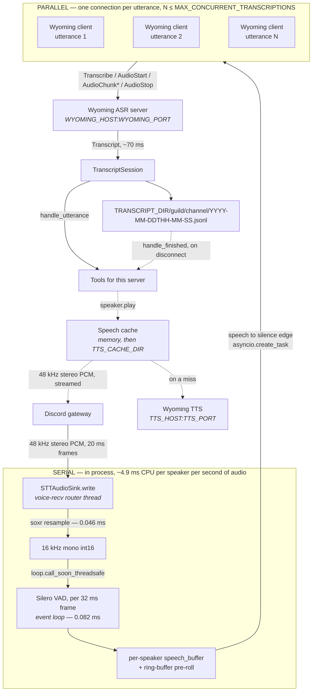

<p align="center">
  
</p>

# miss-quote


> Transcribes Discord voice channels to a per-session, per-speaker JSONL transcript, and hands the result to tools.

Transcription is delegated to a [Wyoming](https://github.com/rhasspy/wyoming) ASR server rather than run in-process, so the bot is a CPU-only workload with no GPU, no model weights, and no cache volume. It is a hard fork of [Leehyunbin0131/Discord-Realtime-STT-Bot](https://github.com/Leehyunbin0131/Discord-Realtime-STT-Bot), which ran `faster-whisper` on a local GPU.

---

## How it works



The dotted half is optional and only exists for tools that answer out loud; a deployment with none never opens a TTS connection.

Everything runs on one event loop in one process. The split that matters is between the two halves of the pipeline: **audio handling is local and serial, transcription is remote and parallel.**

### Local: serial, continuous, cheap

Resampling and VAD are ordinary blocking calls, run one frame at a time. They are a steady cost for as long as audio arrives, not a per-utterance burst — VAD has to see every frame, because VAD is what decides which frames are speech.

| Work | Cost | Rate, per speaker |
|---|---:|---|
| soxr resample, per 20 ms Discord frame | 0.046 ms | 50/s |
| Silero VAD, per 32 ms frame | 0.082 ms | 31.25/s |

That is **~4.9 ms of CPU per speaker per second of audio**, or about 0.5% of one core — 5% at ten concurrent speakers. Being serial costs nothing at this magnitude, which is why there is no worker process: a process boundary would cost more in serialization than the work it isolated.

Resampling runs on voice-recv's router thread, which holds a lock across all speakers, so nothing slow may be added there. Frames reach the event loop via `loop.call_soon_threadsafe`.

### Remote: parallel, bounded

At each speech-to-silence edge the buffered utterance is handed to `asyncio.create_task` and the coroutine immediately parks on socket I/O — the loop is free in the same tick. Nothing in this process ever blocks on transcription.

The ASR server accepts overlapping utterances, so speakers do not queue behind one another; measured against a GPU-backed Wyoming server, eight simultaneous 0.88 s utterances completed in 223 ms against 555 ms if run serially. A single utterance round-trips in about 70 ms.

`MAX_CONCURRENT_TRANSCRIPTIONS` caps how many are in flight. A further utterance ending while the cap is reached parks on the semaphore — it does not stall the loop and does not drop audio, it simply waits to open its connection. The bound exists so a busy channel cannot fan out unbounded connections against an ASR that other services may share; throughput gains past four are marginal anyway.

Upstream got this backwards: it called `transcribe()` inline in the per-frame loop, so the expensive remote half ran serially while audio backed up in a queue until frames were silently dropped.

---

## Transcript format

Transcripts are filed one directory per guild, one per voice channel inside it, and **one file per session** — one visit by the bot to one voice channel:

```
TRANSCRIPT_DIR/
└── first-server/
    ├── general-voice/
    │   ├── 2026-07-26T20-14-03.jsonl
    │   └── 2026-07-27T09-31-55.jsonl
    └── side-room/
        └── 2026-07-27T21-02-40.jsonl
```

A session opens when the bot joins and closes when it leaves — because the channel emptied, because someone disconnected it, or because the pod terminated. The file is named for the moment it opened and keeps that name until it closes, so **a conversation spanning midnight stays in one file** and **rejoining starts a new one**. A session that opens in the same second as another in the same channel gets a `-2` on the end rather than appending to it.

Rejoining is qualified by the **resume window** (`SESSION_RESUME_SECONDS`, 5 s). A channel that empties and refills inside it is treated as one conversation with a gap in it — someone's client dropped, or the last person stepped away — so the transcript is held open and appended to rather than sealed and replaced.

The server directory is its **alias from `servers`**, fixed in configuration rather than read from Discord, so it cannot change underneath the tree. Channels use their Discord name.

Neither carries an ID, which has two consequences worth knowing. **Renaming a channel starts a new directory** with nothing tying it to the old one; that is accepted rather than worked around, since the alternative is an ID in every path to serve a rare event. And **two names that reduce to the same slug share a directory** — two servers given one alias, or two voice channels named `General` and `general`. Their sessions stay in separate files, but nothing in the tree says which file came from where. Nothing about the path can catch either, so the bot logs an error instead: duplicate aliases at startup, colliding channels when it joins one.

Names are lowercased and reduced to `a-z0-9_-`, which drops dots and separators rather than escaping them, so no name can express a path traversal wherever it appears in the string.

JSON Lines, one object per utterance, appended and flushed as produced:

```json
{"ts":"2026-07-26T21:14:03.412-07:00","user_id":1234567890,"user":"someone","text":"that should work"}
```

Guild and channel are not repeated in the line because the path already carries them. `user_id` is recorded alongside the display name because display names change and the path does not encode the speaker.

Timestamps carry an explicit UTC offset, resolved through `TZ`.

---

## Configuration

Mappings do not flatten into environment variables, so they live in `config.yaml`, mounted at `/config/config.yaml` from a ConfigMap. Point `CONFIG_FILE` elsewhere to override the location. The file is read once at startup, so editing it means restarting the pod. The IDs in the repo copy are placeholders.

```yaml
servers:
  123456789012345678:
    alias: first-server
    users:
      234567890123456789: Speaker One
    tools:
      scoreboard:
        enabled: true
      verbal-morality:
        enabled: true
        config:
          words: [fiddlesticks, poppycock]

  876543210987654321:
    alias: second-server
    users:
      234567890123456789: Someone Else
```

Everything about a server lives under its ID, and the ID appears there and nowhere else. The `alias` names the transcript directory, so renaming a server on Discord changes nothing about where its transcripts land.

`servers` is also a hard gate on joining. A server that is not listed is never joined, by autojoin or by an explicit `!join`, and an empty mapping or a missing file means the bot joins nothing at all. That direction is deliberate: joining no server is something you notice and fix, while recording a server the bot should not have been in is not something you can take back.

Parsing **reports rather than raises**. A server whose block is malformed — no `alias`, or not a mapping at all — is dropped and logged at startup; the bot joins one fewer server instead of crash-looping over a typo. The same goes for a name filed under something that is not a user ID, and a tool whose settings will not parse.

On startup the bot reconciles the file against the servers it is actually in, and says so. Four things can be wrong and none of them raise: an entry would not parse, nothing is configured, a server is configured but the bot was never invited, or the bot is in a server nobody configured. Each is logged, so none has to be discovered by noticing an empty transcript directory.

`users` replaces the display name Discord reports for a speaker. Discord nicknames are freely editable and often not a name at all, which makes them poor labels in a transcript that a summarizer will later read. The roster is per server because the same person can be known differently in two places. IDs may be quoted or bare; both are read as integers.

`tools` elects the server into the tools listed under it — see below. Each is opted into on its own, including the ones others depend on: `verbal-morality` hands its fines to `scoreboard`, and a server that enables the first and not the second gets the announcements without the tally.

---

## Tools

A tool reads a server's transcripts and does something with them. Configuration decides only **which servers a tool applies to** and **what settings it is handed**; the tool itself decides when it runs, by defining any of three methods:

```python
class Example(Tool):
    name = "example-tool"

    async def handle_utterance(self, utterance, session) -> None:
        """Called as each line is written."""

    async def handle_finished(self, transcript) -> None:
        """Called once the session is sealed."""

    async def run(self) -> None:
        """Started once the bot has connected, and left going."""
```

A tool is also handed a `speaker`, which is how it answers out loud — see **Speech** below — a `topic`, which is somewhere to put one line where the channel can read it, its server's `users` roster, which is the only thing knowable about who might speak before anybody does, and a `tools` box holding the other tools that server has enabled.

None of the three exists on the base class, so their absence is meaningful: the runner inspects each instance once at startup and files it under the moments it handles. A tool that defines none of them is reported as configured-but-inert rather than silently doing nothing.

- **`handle_utterance`** is dispatched after the line is on disk, so a tool that reads the file sees the same thing it was handed. It is not called for an empty transcription.
- **`handle_finished`** is dispatched once the resume window has passed without a reconnect, so a tool sees one whole conversation rather than a fragment per disconnect. On shutdown, open sessions are sealed immediately rather than waiting the window out.
- **`run`** is the tool's own, started once after the bot connects and left going for the life of the process. A tool that only runs never sees a transcript, which is fine — it is still that server's tool, built with that server's settings and roster. `scoreboard` is the one that exists, publishing a tally on an interval.

All three are coroutines running on the bot's event loop; anything blocking is the tool's own business to push onto a thread. A tool is constructed **once per server** that elects into it, so it may hold state, but its handlers can be entered concurrently — utterances are transcribed in parallel and dispatched as they land, not in the order they were spoken.

A tool may also define **`async def prewarm(self)`**, which the runner calls once per process in the background just after the bot connects, and **`async def close(self)`**, which it calls on the way down once every `run` has been cancelled. `prewarm` is for work a tool can do before anybody asks anything of it — rendering what it already knows it will have to say is the use that exists — and, being the first moment at which every tool on a server exists, is also where to complain about one that is missing. `close` is for whatever has to outlive the process. Neither is a moment: a tool defining only these handles nothing and is still reported as inert, and nothing is prepared for, or awaited on behalf of, a tool that can never run. Warming is **serial** across tools, unlike dispatch, because nothing is waiting on it and the tools with anything to warm are all talking to one synthesizer.

**One tool can call another.** Every tool a server has enabled shares one box, and a tool reaches its neighbour by class:

```python
board = self.tools.find(Scoreboard)
```

Look **at the moment you need it, not in `__init__`**. The box is handed over before any of the server's tools exist and fills as each is built, so a tool that resolves a neighbour at construction finds it or does not depending on the order the config file happens to list them in; by the time anybody has spoken they are all there. Lookup is by class rather than by name so that what a tool depends on is an import a reader can follow, and a tool that is missing comes back as `None` rather than as an error — `verbal-morality` without a `scoreboard` announces fines and does not count them, which is a whole working configuration. A tool that can never run is not in the box at all, so a neighbour never settles for one that will never do anything.

Failures are contained. A tool that raises is logged and otherwise invisible: it cannot cost an utterance, delay a disconnect, or stop another tool from running, warming, or closing. A tool whose `run` raises is logged too, since nothing awaits that task and the exception would otherwise never be collected. A tool that will not construct is reported at startup and skipped.

A tool is only reachable from configuration once it is registered in `tools/registry.py`, which keeps the set of names a config file can switch on a closed list rather than whatever happens to be importable. A name nothing answers to is reported at startup and skipped.

### quotes

Answers the channel with the film line it just walked into. It listens for a trigger phrase and, on hearing one, says the associated quote out loud where it was said.

```yaml
quotes:
  enabled: true
```

There is nothing to configure per server. The pairs come from a CSV at `QUOTES_FILE` — a film, the phrase that sets it off, and the line — so adding a quote is a row rather than a deployment, and a film everybody in one channel has seen is one everybody in the next has too. The image ships the list in `resources/quotes.csv`; mount your own over that path to say something it does not.

```csv
movie,trigger,quote
Firefly,cool,Shiny.
Firefly,behave,I aim to misbehave.
The Princess Bride,impossible,Inconceivable!
Project Hail Mary,question,{user} question is dumb.
```

| Column | Purpose |
|---|---|
| `movie` | Where the line is from. Never spoken; it is what makes the log and the file readable |
| `trigger` | The phrase that sets the line off. Matched whole and case-insensitively, however the file writes it |
| `quote` | What gets said. `{user}` is the only placeholder, and names whoever set it off |

**One trigger per row, and a line may be reached by more than one of them.** Two rows sharing an answer is how the file says that two phrases deserve the same reply — `awesome` and `cool` both earn `Shiny.`. There is no alternation syntax inside a trigger: a trigger is matched as written, so a row meaning to catch two phrases has to be two rows.

Rows are read at startup and the file **reports rather than raises**. A row with no trigger or no line, or a line carrying a placeholder nothing fills, is logged with its line number and dropped — one typo in fifty rows should cost that row. A trigger a later row repeats is dropped the same way, with the first answer kept. What *does* stop the tool from starting is a file that is missing, unreadable, has no `movie,trigger,quote` header, or holds no usable row at all: listening for nothing is enabled and useless, which is worth a line at startup instead of silence forever.

Matching is **whole words, case-insensitive**, so `real` does not fire inside `really`. Several triggers are phrases rather than words, and a phrase matches on a single space between its words, which is what an ASR transcript holds.

**One line per utterance**, however many triggers were in the sentence: two quotes over the top of each other is a denial of service on the channel, and the pause while the second one plays has outlasted the joke either way. The one that answers is the **earliest in the sentence** rather than the first in the file, since that is the one whoever spoke arrived at. Where two triggers start at the same word the longer wins — `case of the mondays` is in the list precisely because it deserves a different answer from `monday`.

**A trigger that has just fired goes quiet for `QUOTE_BACKOFF_SECONDS`**, five minutes by default. The joke is the recognition, and a channel that says "cool" four times in a minute does not want "Shiny." four times back. `0` answers every trigger every time, for a deployment that wants that. The window is keyed on the **trigger**, not the speaker and not the line: what wears out is the phrase, so two people arriving at the same word inside five minutes hear one answer, while two rows that share a line cool down separately. A trigger on backoff does not swallow a live one later in the same sentence — the earliest trigger that is still fresh is the one that answers. The window is per server and held in memory only, so two channels arriving at the same line have each made the joke once, and a restart forgives every backoff.

`{user}` is filled with the name the transcript uses — the roster name from `users` where a server has set one, the Discord display name otherwise — so nothing has to be configured twice.

**The whole list is rendered at startup.** Unlike a fine, a quote is knowable in full before anybody speaks: the triggers are a closed set and so are the answers, so on the way up the tool synthesizes every line in the file and leaves the results in the speech cache. A callback that arrives four seconds after the line it answers is not a callback. The exception is a line naming whoever set it off, which is rendered once per name on the roster; somebody the server has not written down waits for the synthesizer the first time, and nobody waits again. Warming happens in the background, one phrase at a time, and anything already cached is left alone.

### scoreboard

Keeps a running balance per person, writes it down, and puts the standings under the name of whatever voice channel the bot is in. It hears nothing and says nothing out loud; what it does is count for the tools that ask it to.

```yaml
scoreboard:
  enabled: true
```

There is nothing to configure per server. Where the tally lives, what it is counted in, and how often it is written and published are the `CREDITS_*` variables, because there is one file behind every server's board and how often it is written is a property of the file rather than of any one server.

**It is enabled separately from whatever is counting.** A server that wants fines announced but not tallied enables `verbal-morality` and not this; the fines are announced and nothing is kept, and the log says so once at startup rather than leaving it to be discovered by wondering why the channel topic is empty.

**Other tools count through it.** `credit` and `debit` are the whole interface, and they are what a tool calls when it has decided somebody owes something:

```python
board = self.tools.find(Scoreboard)
if board is not None:
    balance = board.debit(user_id, name, offences)
```

The name arrives with the change rather than being looked up, because the caller has just heard from whoever it is and the board prints whatever it was last told. Where the balance is kept, when it is written, and who is eligible for the board are the scoreboard's business and not the caller's.

**The standings go in the voice channel topic**, as `Eli: -9 Erik: -2 Luke: -1 Ryan: 0`, which makes the topic the scoreboard — visible without asking the bot anything. A fine is a **debit**: everybody starts at nothing and goes down, so the number beside a name reads as what swearing has cost them rather than as points collected. Nothing assumes that direction — `credit` puts it back — but nothing today calls it.

The board holds the **four furthest into the red, worst first**. A leaderboard rearranges itself every time somebody passes somebody else, which is the objection to publishing a whole roster in name order; at four places it is short enough to read at a glance, and who is winning is the thing worth reading. Ties break on the name, so two people on the same balance do not swap places between one edit and the next for no reason anybody can see.

**Only `users` are eligible for the board.** Everyone on the roster starts on it at nothing spent, so a channel says who is being watched before anybody has sworn. Somebody the server never wrote down is still heard, still announced, and still counted under whatever Discord reports — they are simply not published, because a display name its owner can set to anything is not something to put in a channel topic through this. Adding them to `users` puts them on the board with whatever balance they had already run up. A board too long for Discord's 1024 characters is cut on an entry boundary rather than mid-number; four ordinary names never reach it, and the guard is there because nothing stops somebody trying. A server with no roster at all publishes nothing rather than an empty line, since setting the status to nothing would wipe whatever a person had put there.

Counts are **per server**. The same person swearing in two servers owes two separate debts, because a server's words are its own business and so is what they cost. Identity is the user ID and the name is only what gets printed, so a rename does not hand somebody else's debt to whoever inherited their nickname.

The tally is kept in `CREDITS_FILE` and **loaded at startup**, so a restart is not an amnesty. It is written back on the same interval it is published on, and again on shutdown — the shutdown pass writes the file but does not touch the topic, because a channel edit waiting out a rate limit would sit on `SIGTERM` until the pod was killed outright. A file that will not parse is reported and ignored rather than raised on: it is a tally of imaginary money, and the pod starting matters more. One unreadable entry costs one person's total, not the file.

There is **one file behind every server's board**, so the mark for whether it has changed belongs to the file rather than to any one board; two servers ticking a moment apart would otherwise rewrite the whole thing twice for one change. A lock keeps the second write from starting while the first is still going.

What it actually sets is the channel's **status**, not its topic. A voice channel has no topic: `PATCH /channels/{id}` with one is refused, and refused with `CHANNEL_TOPIC_INVALID`, *"Field contains at least one word that is not allowed"* — which reads like a profanity filter and is nothing of the kind, since it refuses a topic of `test` identically. The status is the line the client shows beneath a voice channel's name, which is what a topic looks like on a voice channel and what somebody setting one by hand would set. Settings and prose here say topic because that is what it is to everybody looking at it; only the call itself knows the difference. It needs **Set Voice Channel Status** on the channel — not Manage Channels — and without it the tool logs once per change and keeps counting.

The **status is not set on every change.** Both the write and the edit are driven off a revision counter, so a tally that changed four times between two ticks costs one of each. They run on **separate intervals**, because they are limited by different things: writing a few hundred bytes is cheap and happens every `CREDITS_SAVE_SECONDS`, while a status edit is rate-limited — though not nearly as hard as a channel rename, at a bucket of roughly six a second — so `CREDITS_TOPIC_SECONDS` is a question of how often a tally is worth reading rather than of what the API will tolerate. Saving still happens first on every tick: an edit that lands in a bucket can hold the task while discord.py sleeps it out, and a pod terminated in the middle of one should still have the tally on disk from the tick before.

A request Discord **refuses** — a `400`, or a missing permission — is not retried, because retrying it every interval would spend the channel's rate limit on an answer that cannot change. A tally that then changes is published anyway, since what was refused was that text and the next text is not that text. Every failure is logged with the string it was trying to set, because a rejection caused by a name in the tally cannot be diagnosed from the fact of it. A tally that reached nowhere at all — the bot is in no voice channel yet — is left unpublished rather than marked done, so it lands in the next channel the bot joins instead of waiting for somebody to swear again.

The half that talks to Discord is `bot/topic.py`; the tool itself imports no discord, on the same terms as the speaker.

### verbal-morality

The Verbal Morality Bot, after *Demolition Man*. It listens for words the server has decided against and, on hearing one, announces the fine out loud in the channel it was said in. The credits are imaginary but they are counted, by somebody else: the fine is handed to the server's [`scoreboard`](#scoreboard), which is what keeps a balance, writes it down, and publishes the standings. **With no `scoreboard` enabled the fine is announced and not counted**, which the log says once at startup.

```yaml
verbal-morality:
  enabled: true
  config:
    words: [fiddlestick, poppycock]
    announcement: "{user}, you are fined {credits} for {violations} of the verbal morality statute."
    repeat_announcement: "{user}, you are also fined {credits} for {violations} of the verbal morality statute."
    chime: chime.wav
```

| Setting | Required | Purpose |
|---|---|---|
| `words` | yes | Stems of what the server objects to. A lone one may be written unquoted rather than as a list |
| `announcement` | no | What gets said. `{user}`, `{credits}`, and `{violations}` are the placeholders |
| `repeat_announcement` | no | Said instead when the same speaker is fined again inside `REPEAT_FINE_SECONDS`. Same placeholders |
| `chime` | no | A WAV in the speech cache directory, played ahead of the announcement |

Both templates default to the lines above, which the tool carries, so a server that wants the defaults can leave them out. A template with a placeholder nothing fills is rejected at startup rather than at the moment someone swears, and the error names which of the two it was.

The name is the one the transcript uses — the roster name from `users` where a server has set one, the Discord display name otherwise — so nothing has to be configured twice.

**`words` are stems.** Each is expanded once at startup into the endings it is said with — a plural, a past tense, a gerund with and without its `g`, someone who does it, something that is like it, and the three that make it a noun again — so `fiddlestick` also catches `fiddlesticks`, `fiddlesticked`, `fiddlesticking`, `fiddlestickin`, `fiddlesticker`, `fiddlestickers`, `fiddlesticky`, `fiddlestickity`, `fiddlestickery`, and `fiddlestickiness`. A list that has to spell out every ending is a list somebody gets around a week after writing it.

Expansion is English spelling rather than a dictionary: a final consonant doubles after a short vowel (`shit` grows a `shitter`, not a `shiter`), a silent `e` drops before a vowel, a sibilant takes `es`, and a `y` after a consonant becomes an `i` — except before an ending that already starts with one, where it goes without being replaced, so it is `shittiness` and not `shittyiness`. The `-ity`, `-ery`, and `-iness` endings are there because the words they reach are ones people say: `fuckery`, `buggery`, `shittiness`. Nothing checks whether the result is a word anybody says, and it does not need to — a form nobody utters costs a few bytes in an alternation, while a missing one costs the tool the thing it exists to catch. Note that expansion can reach a word that is innocent on its own; a stem whose endings collide with ordinary speech is worth checking before it goes in the list.

Matching is **whole words, case-insensitive**. A substring match fines the innocent, and the canonical example, Scunthorpe, is a place people live.

**The fine scales with the utterance**: one credit per forbidden word in it, so three of them is `3 credits` and one is `1 credit`. The count is filled into `{credits}` already pluralized, as a numeral — every synthesizer worth pointing this at reads `3` as a number, and `1 credits` is wrong in a way a listener hears. What a credit is *called* is `CREDIT_CURRENCY`, and the plural is grown from it by the same spelling rules the word list uses, so `penny` announces as `2 pennies` and no deployment can end up fining anybody `2 pennys`. `{violations}` agrees with the count, reading `a violation` for one and `multiple violations` for more, so the sentence is not left saying "fined 3 credits for a violation". It is a phrase rather than a second count: the number is already in the fine, and saying it twice makes the announcement sound like an invoice.

What does not scale is the number of announcements. Three violations in one utterance earn one, because three announcements over the top of each other is a denial of service on the channel. **A violation earned while an announcement is playing is counted and not announced at all** — the speaker plays one clip at a time and returns when it is finished, so the alternative is a queue, and a channel where three people swear over each other would spend the next minute being read fines for things it has moved on from. The tally is charged either way: what somebody owes is not a function of whether they were told about it.

**Being fined twice in a row is worded differently.** A speaker fined again inside `REPEAT_FINE_SECONDS` gets `repeat_announcement` — "you are *also* fined" — because reading the whole sentence out again sounds like a bot that has lost track of what it just said. It is per speaker: somebody else swearing in the meantime does not make their first fine a repeat. Both wordings are pre-rendered, so the second one does not cost a synthesizer round trip at the moment it is needed.

**A repeat offender is announced more quietly.** Being fined is the joke, and the joke told fifteen times in five minutes is a denial of service on the conversation. Every violation inside a sliding `VOLUME_BACKOFF_DURATION` takes `VOLUME_BACKOFF_PERCENT` off the next announcement, down to `VIOLATION_VOLUME_FLOOR` — at the defaults, 5% a violation over five minutes, floored at a quarter of `PLAYBACK_VOLUME`, so fifteen of them reach the bottom. `0` for the percent takes nothing off and turns the backoff off; `0` for the floor silences a repeat offender outright. The first swear in a window is announced at full volume: the backoff is for saying it again. Each forbidden word counts, on the same terms as the fine, so four in a sentence is four steps down however few announcements it took to say so. The window is per speaker and per server, held in memory only — a `VOLUME_BACKOFF_DURATION` after their last violation somebody is back to full volume, and a restart forgives whatever backoff they had earned. What it does **not** affect is the tally: what somebody owes is not a function of how loudly they were told about it.

**The announcements are rendered at startup.** The roster is known before anybody speaks and so is the shape of the sentence, so on the way up the tool synthesizes every name in `users` against one, two, and three violations, in both the first-fine and the repeat wording, and leaves the results in the speech cache. Synthesis is the slow part of answering; paying for it before anyone is waiting is what lets the fine land while the offence is still what the channel is talking about. It happens in the background, one phrase at a time — the bot is in the channel and listening while it runs, and a synthesizer asked for a hundred phrases at once is one that is not answering whoever is speaking right now.

Three violations because that is what a sentence usually holds; a fourth is remarkable enough to wait for the synthesizer. Anything already cached, from an earlier run or a real fine, is left alone rather than rendered again — including the second wording where a server has set both templates to the same string. What cannot be warmed is anyone **not** on the roster: they are announced under whatever Discord reports, which is not knowable at startup and not a closed set, so they pay for their first fine and nobody pays for it again. Warming also does not count as playing, so a pre-rendered announcement nobody ever earns ages out of the cache on the usual terms and is warmed again at the next startup.

`chime` is resolved **inside** `TTS_CACHE_DIR` — a bare name, or a path below it; anything that climbs out is refused at startup. It must be a **16-bit WAV**, at any sample rate and in mono or stereo, both of which are converted on the way in. WAV rather than MP3 because playing audio without ffmpeg is the point of this path, and nothing in the image can decode anything else. The clip is read once, kept for the life of the process, and never evicted to make room for a phrase. A chime that is missing or will not parse is reported and costs the chime, not the announcement.

A server electing in with no `words` is enabled and listening for nothing, which is reported at startup rather than left to be discovered by swearing at it.

## Speech

Tools answer out loud through a `Speaker`, which the bot implements against the voice channel an utterance came from. Nothing in `tools/` imports discord: a speaker is somewhere to play audio, and it happens to be a voice channel.

Synthesis is a second Wyoming server (`TTS_HOST`, `TTS_PORT`) — recognition and synthesis are both Wyoming, but they are two servers and only one of them wants a GPU. The voice is process-wide: a bot that answers in two voices is a bot nobody can tell is one bot.

**Audio streams.** The client yields chunks as the synthesizer produces them, and playback starts on the first one rather than waiting for the last. Discord's player is a thread that asks for exactly one 20 ms frame at a time and treats anything short of one as the end of the clip, so `bot/speaker.py` buffers between the two: filled from the event loop, drained a frame at a time, with the tail padded to a whole frame so the last few milliseconds of a word survive. A synthesizer that stalls mid-clip costs the rest of that clip after `TTS_STALL_SECONDS`, not a thread and a voice connection.

**A clip waits for a head start** (`TTS_LEAD_MS`, 500 ms by default) before the first byte of it is handed to the player. Streaming is the contract, not a promise: a synthesizer is free to render a phrase whole before sending any of it, which makes the first chunk the slow one and every chunk after it instant. That is invisible for a clip that is only speech, and audible for one that opens with a chime — the flourish plays, and then the channel sits silent until the sentence it introduced arrives. Waiting for this much speech first moves the wait to before the chime, where nobody is listening yet. A phrase that ends inside the head start is not padded out to it, and `0` starts on the first chunk, which is what a synthesizer that streams as it renders wants.

**Loudness is a deployment setting** (`PLAYBACK_VOLUME`, `1.0` by default), because how loud a synthesizer renders a sentence has nothing to do with how loud a channel wants to be interrupted. It scales every sample on its way to the player, so a chime is turned down with the words behind it, and it is applied at playback rather than folded into a rendered clip — changing it does not invalidate a cache full of phrases. Above `1.0` the result is clipped at full scale rather than allowed to wrap, since int16 wraps to the opposite extreme and that is a crack in the middle of a word rather than more of the same.

**No ffmpeg.** It is the usual way to play audio through discord.py, but only because it is the usual way to decode a file first. Synthesized speech is already raw PCM, so `soxr` converts it to the 48 kHz stereo Discord wants and the Opus encoder already present for receiving handles the rest.

**Clips are cached**, so a phrase is only ever synthesized once, in two layers holding the form that suits each:

| Layer | Holds | Why |
|---|---|---|
| Memory | Playback-ready 48 kHz stereo PCM | A hit costs a dictionary lookup |
| Disk (`TTS_CACHE_DIR`) | The synthesizer's own mono WAV | A quarter the size, and playable, so you can hear what the bot actually said |

The first hit after a restart pays one resample and nothing else. Mount a volume at `TTS_CACHE_DIR` to keep clips across restarts; an unwritable or absent directory costs the persistence, not the feature. Writes go through a temporary file and a rename, because a process killed mid-write would otherwise cache a truncated clip forever, and a clip is only stored once the synthesizer says it is whole — a failure partway through plays what arrived and stores nothing.

The memory layer is bounded (`TTS_CACHE_ENTRIES`) because what gets synthesized can include a Discord display name, and those are not a closed set. What goes when it is full is the **least recently used** clip, not the oldest: entries do not arrive one at a time, since a whole roster is rendered at startup in no order that means anything, and evicting by arrival would retire whoever happened to be warmed first however much they talk. That puts the memory layer on the same footing as the disk layer, which ages by use for the same reason.

**A phrase can be rendered before it is needed.** A tool that can work out at startup what it will have to say later warms the cache with it from `prewarm`, and a phrase already in either layer costs nothing to warm. A warmed clip is deliberately **not** treated as a played one: a phrase already held is left exactly as found, neither touched on disk nor moved to the back of the memory queue, so what nobody ever earns ages out of both layers like anything else nobody plays. With no memory layer and no usable directory there is nowhere to put the result, and warming does nothing rather than paying a synthesizer for audio nobody will ever be served.

**The disk layer is reaped at startup** (`TTS_CACHE_RETENTION_DAYS`, 90 by default). The directory otherwise only grows: a display name goes into the key, so everyone who has ever been announced leaves a file behind, and none of them is ever asked for again once they leave the server. Age is the **mtime**, not the filename, and every hit touches the file — including one served out of memory, which never opens it — so what is still in use stays however old it is and only what nothing plays ages out. A reaped phrase costs one synthesis the next time it is said.

Only rendered speech is reaped, identified by name: a clip the cache wrote is a SHA-256 digest, which nothing anybody would type by hand looks like, and the scan does not descend into subdirectories. A chime is safe on both counts. Any value below `1` disables the reaper entirely, so `0` is a no-op rather than "delete everything".

The same directory also holds **clips nobody synthesized** — a chime a tool plays ahead of what it has to say. Drop a 16-bit WAV in and name it from the tool's config; it is read once, converted to playback PCM, and held apart from rendered speech so it is never evicted for a phrase somebody said once. Names are resolved against the directory rather than taken at their word: a setting cannot be pointed at an arbitrary file on the host.

## Environment

Every setting is read from the environment; `.env` is loaded if present. Nothing about a particular deployment is baked into the image, so the same image runs anywhere the variables below point it at.

### Discord

| Variable | Default | Purpose |
|---|---|---|
| `DISCORD_TOKEN` | — | Bot token. **Required** — the bot exits immediately without it |
| `COMMAND_PREFIX` | `!` | Prefix for the `!join` / `!leave` commands |
| `AUTOJOIN` | `true` | Join when a human enters a voice channel; leave when it empties. Accepts `true/false`, `1/0`, `yes/no`, `on/off` |

### ASR

| Variable | Default | Purpose |
|---|---|---|
| `WYOMING_HOST` | `localhost` | Hostname or service name of the Wyoming ASR server |
| `WYOMING_PORT` | `10300` | Wyoming's conventional port |
| `STT_LANGUAGE` | `en` | Sent as `Transcribe.language` |
| `MAX_CONCURRENT_TRANSCRIPTIONS` | `4` | Ceiling on in-flight utterances, so a busy channel cannot open unbounded connections against a shared ASR |

### TTS

Only used by tools that answer out loud. A deployment with no such tool enabled never opens a connection.

| Variable | Default | Purpose |
|---|---|---|
| `TTS_HOST` | `localhost` | Hostname or service name of the Wyoming TTS server |
| `TTS_PORT` | `10200` | Wyoming's conventional TTS port |
| `TTS_VOICE` | — | Voice to ask for. Empty takes whatever the synthesizer considers its default, so a server with one voice loaded needs no setting |
| `TTS_TIMEOUT_SECONDS` | `30.0` | Budget for a **single** wait on the synthesizer, not for a whole clip — a long phrase arriving steadily is not cut off for taking a long time |
| `TTS_STALL_SECONDS` | `10.0` | How long the player waits mid-clip for audio that never comes before ending it |
| `TTS_LEAD_MS` | `500.0` | How much speech to have in hand before a clip starts playing, so a synthesizer that renders a phrase whole leaves no gap behind a chime. `0` starts on the first chunk |
| `PLAYBACK_VOLUME` | `1.0` | Scales everything played into a channel, chime included. `1.0` is however loud the synthesizer rendered it, `0.8` is 20% quieter, `1.2` is 20% louder and clipped rather than wrapped. Any value below `0` is treated as silence |
| `TTS_CACHE_DIR` | `/cache/tts` | Rendered speech. Mount a volume here to keep it across restarts |
| `TTS_CACHE_ENTRIES` | `256` | Clips held in memory before the least recently used is retired |
| `TTS_CACHE_RETENTION_DAYS` | `90` | Days a rendered clip survives on disk without being played, counted from the last time it was. Any value below `1` keeps them forever; clips left there by hand are never reaped |

### Quotes

Only used by `quotes`. A deployment with it disabled never opens the file.

| Variable | Default | Purpose |
|---|---|---|
| `QUOTES_FILE` | `/app/src/miss_quote/resources/quotes.csv` | The triggers and the lines they answer with, as a CSV of `movie,trigger,quote`. One list per deployment; the image ships the one in `resources/`, and mounting a file over that path replaces it |
| `QUOTE_BACKOFF_SECONDS` | `300.0` | How long a trigger stays spent after it fires, so a channel that keeps saying the same word hears the line once. `0`, or any value below it, answers every trigger every time |

### Credits

Only used by `scoreboard`. A deployment with it enabled nowhere never reads or writes the file, and never touches a channel topic.

| Variable | Default | Purpose |
|---|---|---|
| `CREDITS_FILE` | `/credits/credits.json` | The running tally, as JSON. One file behind every server's board. Mount a volume at its directory to keep what everybody owes across restarts |
| `CREDIT_CURRENCY` | `credit` | What a balance is denominated in, in the singular. The plural is grown from it by the spelling, so `penny` announces as `2 pennies`. Wording only — it changes nothing about what is counted |
| `CREDITS_SAVE_SECONDS` | `5.0` | How often a changed tally is written to disk. `0`, or any value below it, stops the loop: the tally is kept in memory and written only on shutdown |
| `CREDITS_TOPIC_SECONDS` | `10.0` | How often a changed tally is published to the voice channel topic — set as the channel **status**, a voice channel having no topic. `0`, or any value below it, keeps the tally off the channel entirely |

### Fines

Only used by `verbal-morality`. What a fine is *worth* is the scoreboard's, above; these are how it is said.

| Variable | Default | Purpose |
|---|---|---|
| `REPEAT_FINE_SECONDS` | `5.0` | How soon after being fined the same speaker is told they are "also fined" rather than hearing the whole sentence again. `0`, or any value below it, turns the second wording off |
| `VOLUME_BACKOFF_DURATION` | `300.0` | The sliding window a violation counts for against how loudly the next one is announced |
| `VOLUME_BACKOFF_PERCENT` | `5` | How much each violation inside that window takes off the next announcement. `0` takes nothing off, turning the backoff off; anything above `100` reaches the floor on the first repeat, and anything negative is treated as `0` rather than made louder |
| `VIOLATION_VOLUME_FLOOR` | `0.25` | The quietest a fine is announced, as a fraction of `PLAYBACK_VOLUME`, once a speaker has earned the full backoff. `0` silences a repeat offender entirely; `1` turns the backoff off |

### Transcripts

| Variable | Default | Purpose |
|---|---|---|
| `TRANSCRIPT_DIR` | `/transcripts` | Directory the session files are written to |
| `TZ` | `America/Los_Angeles` | Timezone for session filenames and the offset stamped on each line |
| `RETENTION_DAYS` | `-1` | Days to keep. `-1`, or any value below `1`, keeps forever |
| `SESSION_RESUME_SECONDS` | `5.0` | How long a transcript is held open for a reconnect to the same channel. `0` seals it on disconnect |

### Speech segmentation

| Variable | Default | Purpose |
|---|---|---|
| `SPEECH_FLUSH_TIMEOUT_SECONDS` | `2.0` | Transcribe a speech buffer that stopped receiving audio, e.g. a speaker who muted mid-sentence |
| `USER_TIMEOUT_SECONDS` | `60` | Discard per-user VAD state after this much silence |
| `LOG_LEVEL` | `INFO` | Standard Python log levels |

VAD thresholds, the pre-roll depth, and the Wyoming chunk size are deliberately **not** environment variables — they are tied to Silero's fixed 512-sample frame and live in `config.py`.

### Retention

Pruning is **off by default**. Any value below `1` disables it entirely, so `0` is a no-op rather than "delete everything" and a mis-set variable cannot destroy the archive. When set to a positive `N`, files older than `N` days are deleted, aged by the **date at the front of the filename** rather than mtime — the filename is the authoritative record of when a transcript was taken, while mtime misjudges a file appended to late or restored from backup. Pruning runs at startup and whenever a session opens.

### Auto-join

With `AUTOJOIN` enabled the bot connects as soon as a non-bot member enters a voice channel, and disconnects once the channel empties of humans. A bot can occupy only one voice channel per guild, so if a second channel becomes active it stays where it is rather than hopping, which would fragment both transcripts.

The `!join` and `!leave` commands remain available either way. They require **Message Content Intent** to be enabled in the Discord Developer Portal.

---

## Changes from upstream

Upstream ran `faster-whisper` in-process on a GPU. Moving transcription to a network call removed the reason for most of the machinery around it.

| Area | Upstream | Here |
|---|---|---|
| Transcription | `faster-whisper` in-process, GPU | Wyoming client, one connection per utterance |
| Concurrency | Child process + three IPC queues, to keep blocking inference off the event loop | One process, one event loop; each utterance is a bounded `asyncio` task |
| Dispatch | Transcription called inline in the per-frame loop, serializing every speaker behind one utterance until the audio queue overflowed and dropped frames | Per-utterance tasks bounded by a semaphore, so speakers overlap |
| Resampling | `torchaudio` | `soxr` |
| VAD | Silero via `torch.hub` | Silero via `onnxruntime`, model vendored in-repo |
| Output | Logged and printed; never persisted | Per-session JSONL file, flushed per utterance |
| Deployment | systemd unit | Container image |

Removed outright: the multiprocessing layer and its queues, the STT health-check thread and its supervisor, `torch` / `torchaudio` / `faster-whisper`, the model and fallback-model settings (`STT_MODEL_ID`, `STT_DEVICE`, `STT_COMPUTE_TYPE`, `STT_BEAM_SIZE`, every `STT_FALLBACK_*`), all `*_QUEUE_MAXSIZE` tuning, `RESULT_POLL_INTERVAL`, `STT_HEALTH_CHECK_INTERVAL`, `SHUTDOWN_TIMEOUT_SECONDS`, and the systemd deployment.

Kept intact because they are the non-obvious part: `stt/user_state.py`'s per-user VAD state machine with stale-speech flushing, and `audio/ring_buffer.py`'s pre-roll buffer, which is what stops the first syllable being clipped.

Added: `AUTOJOIN`, `RETENTION_DAYS`, `TRANSCRIPT_DIR`, `TZ`, `SESSION_RESUME_SECONDS`, `WYOMING_HOST`, `WYOMING_PORT`, `MAX_CONCURRENT_TRANSCRIPTIONS`, `PLAYBACK_VOLUME`, `CREDITS_FILE`, `CREDIT_CURRENCY`, `CREDITS_SAVE_SECONDS`, `CREDITS_TOPIC_SECONDS`, `REPEAT_FINE_SECONDS`, `VOLUME_BACKOFF_DURATION`, `VOLUME_BACKOFF_PERCENT`, `VIOLATION_VOLUME_FLOOR`, `QUOTES_FILE`, `QUOTE_BACKOFF_SECONDS`, and every `TTS_*`.

> **Note on the vendored VAD model.** Silero v5's ONNX graph scores the current frame *together with* the trailing 64 samples of the previous one. Fed a bare 512-sample frame it does not error — it silently returns near-zero probability on unmistakable speech, and the bot transcribes nothing. `stt/vad.py` carries that context between calls, and `tests/test_vad.py` guards it with real speech; silence-based tests pass either way and will not catch a regression.

---

## Project structure

```
miss-quote/
├── pyproject.toml             # What builds the package, and nothing else
├── setup.cfg                  # The package itself: metadata and where it lives
├── pytest.ini
├── requirements.txt           # What the image installs
├── config.yaml                # A sample of the mounted file
├── src/
│   └── miss_quote/
│       ├── __main__.py        # Entry point: python -m miss_quote
│       ├── config.py          # Grouped configuration (dataclasses)
│       ├── bot/
│       │   ├── client.py      # Bot setup, voice lifecycle, auto-join policy
│       │   ├── audio_sink.py  # AudioSink + resampling bridge
│       │   ├── speaker.py     # Playback into a voice channel, fed while it plays
│       │   └── topic.py       # A line under the name of the channel the bot is in
│       ├── audio/
│       │   ├── resampler.py   # soxr, both directions
│       │   ├── gain.py        # Playback loudness
│       │   └── ring_buffer.py # Pre-speech context buffer
│       ├── stt/
│       │   ├── vad.py         # Silero VAD via onnxruntime
│       │   ├── user_state.py  # Per-user VAD state machine
│       │   ├── processor.py   # Segmentation and bounded dispatch
│       │   ├── wyoming_client.py  # Per-utterance Wyoming round-trip
│       │   └── models/
│       │       └── silero_vad.onnx  # Vendored (~2 MB)
│       ├── ledger/
│       │   └── credits.py     # What everybody has left, per server
│       ├── resources/
│       │   └── quotes.csv     # Triggers and the film lines they answer with
│       ├── tools/
│       │   ├── base.py        # What a tool is: its moments, and what it is handed
│       │   ├── registry.py    # Tool names a config file can switch on
│       │   ├── runner.py      # Per-server instances, dispatch, failure isolation
│       │   ├── quotes.py      # Answers a trigger phrase with the line it belongs to
│       │   ├── scoreboard.py  # The tally, to disk and to the channel topic
│       │   └── verbal_morality.py  # Fines a speaker, out loud, for the wrong thing
│       ├── transcript/
│       │   └── writer.py      # Per-session JSONL appender + retention
│       ├── tts/
│       │   ├── client.py      # Streaming Wyoming synthesis
│       │   └── cache.py       # Render a phrase once, keep it in memory and on disk
│       └── utils/
│           ├── logging.py
│           └── stems.py       # A stem and the endings it is said with
└── tests/
```

Paths in prose below are written relative to `src/miss_quote/`, which is where all of the code is.

The package directory is `miss_quote` where everything else is `miss-quote`, a hyphen not being importable. It sits under `src/` so that a test run imports the package that is on the path rather than whatever happens to be in the working directory — the failure a flat layout hides is a module that only resolves because pytest added the repository root.

Dependencies stay in `requirements.txt` rather than `setup.cfg`, because one of them is pinned to a VCS revision and the image installs it verbatim. Nothing installs the package: `PYTHONPATH` points at `src/`, in the container and in `pytest.ini` both.

The Silero model is vendored rather than installed, because the `silero-vad` package declares `torch` even in ONNX mode.

---

## Development

```bash
python3.12 -m venv .venv && source .venv/bin/activate
pip install -r requirements-dev.txt
pytest
```

The ASR path is the riskiest integration and is worth exercising on its own, before any Discord wiring. Point `WYOMING_HOST` at any reachable Wyoming server and send the bundled speech fixture through the client:

```bash
PYTHONPATH=src WYOMING_HOST=<asr-host> python -c "
import asyncio, wave
from miss_quote.stt.wyoming_client import transcribe
with wave.open('tests/fixtures/speech_16k_mono.wav', 'rb') as f:
    pcm = f.readframes(f.getnframes())
print(asyncio.run(transcribe(pcm)))
"
```

A correct setup prints `That should work.` in well under a second.

---

## Deployment

GitHub Actions builds the image and pushes it to GHCR for the repository it runs in; no registry configuration is required beyond the workflow's `packages: write` permission. New GHCR packages are private by default, so the package must be made public once, after the first run, unless the cluster is given a pull secret.

Runtime requirements:

- **A reachable Wyoming ASR server** — set `WYOMING_HOST` and `WYOMING_PORT`. There is no default that will work out of the box.
- **A writable volume at `TRANSCRIPT_DIR`.** Use a shared (`ReadWriteMany`) volume if anything else will need to read the transcripts; a single-writer volume locks them to this pod and forces an export step later.
- **A writable volume at the directory holding `CREDITS_FILE`**, if `scoreboard` is enabled anywhere. Without one the tally is forgiven at every restart, which costs the accounting rather than the feature. **Set Voice Channel Status** on each voice channel is what lets the tally reach it; without it the bot keeps counting and says so in the log.
- **A single replica.** Two instances would double-join the voice channel and double-write the transcript.
- **No GPU and no node constraints** — transcription is a network call.

**Cutting a git tag is the deploy action.** Pushing to `main` produces `latest` and a sha tag, neither of which is orderable; a release needs a semver tag, which is what a pinned deployment references and what dependency automation can raise a bump against:

```bash
git tag v0.1.0 && git push origin v0.1.0
```
