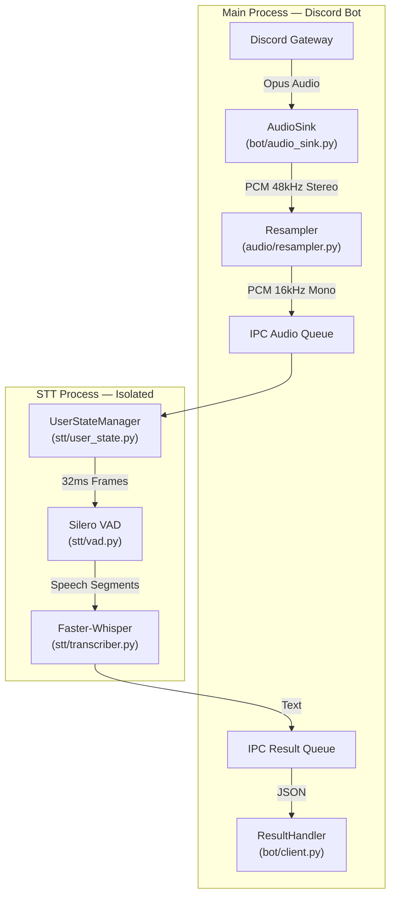

# 🎙️ Discord Real-time STT Bot


> **High-performance, low-latency Speech-to-Text for Discord voice channels.**
> Process-isolated architecture ensures the bot **never** freezes during inference.

---

## ⚡ Key Features

| Feature | Implementation |
|---|---|
| **Multiprocessing Core** | STT runs in an isolated process — bot never freezes |
| **Anti-aliased Resampling** | `torchaudio` Kaiser-window filter (48 kHz → 16 kHz) |
| **Ring Buffer** | 320 ms pre-speech context — first syllable is never cut |
| **Silero VAD** | State-of-the-art voice activity detection |
| **Faster-Whisper** | CTranslate2 — 4× faster than OpenAI Whisper |
| **Structured Logging** | Python `logging` with module-level loggers |
| **Graceful Shutdown** | Signal handlers for clean exit |
| **Per-User State** | Encapsulated `UserState` dataclass per speaker |

---

## 🛠️ Architecture



---

## 📁 Project Structure

```
Discord-Realtime-STT-Bot/
├── main.py                 # Entry point (graceful shutdown)
├── config.py               # Grouped configuration (dataclasses)
├── bot/
│   ├── client.py           # Bot setup, commands, result handler
│   └── audio_sink.py       # AudioSink + resampling bridge
├── audio/
│   ├── resampler.py        # torchaudio anti-aliased resampling
│   └── ring_buffer.py      # Generic ring buffer
├── stt/
│   ├── processor.py        # STT process main loop
│   ├── vad.py              # Silero VAD wrapper
│   ├── transcriber.py      # Faster-Whisper wrapper
│   └── user_state.py       # Per-user state dataclass + manager
├── utils/
│   └── logging.py          # Structured logging config
├── requirements.txt
├── .env                    # DISCORD_TOKEN=your_token_here
└── README.md
```

---

## 📦 Installation

### Prerequisites
-   **Python 3.10+**
-   **NVIDIA GPU** (Recommended for <0.5s latency)
-   **FFmpeg** (Required for audio processing)

### 1. Clone & Install
```bash
git clone https://github.com/your-repo/discord-stt-bot.git
cd discord-stt-bot
pip install -r requirements.txt
```
> *Note: `torch` + `faster-whisper` may exceed 2 GB total.*

### 2. Configuration
Create a `.env` file:
```env
DISCORD_TOKEN=your_super_secret_token_here
```

Fine-tune settings in `config.py` (all grouped by category).

### 3. Run
```bash
python main.py
```

---

## ⚙️ Configuration (`config.py`)

| Group | Setting | Default | Description |
|:---|:---|:---|:---|
| **STT** | `model_id` | `deepdml/faster-whisper-large-v3-turbo-ct2` | HuggingFace model ID |
| | `device` | `cuda` | `cpu` if no GPU |
| | `beam_size` | `1` | Lower = faster, Higher = accurate |
| **VAD** | `ring_buffer_frames` | `10` | Pre-speech context (~320 ms) |
| | `frame_samples` | `512` | Silero requires 512 @ 16 kHz |
| **Audio** | `input_sample_rate` | `48000` | Discord Opus decoded rate |
| | `output_sample_rate` | `16000` | Whisper input rate |
| **Process** | `user_timeout_seconds` | `60` | Inactive user cleanup |

---

## 🖥️ Usage

1.  **Summon**: `!join` in any text channel
2.  **Speak**: Talk — the bot listens to everyone simultaneously
3.  **Dismiss**: `!leave` to disconnect
4.  **Stop**: `Ctrl+C` for graceful shutdown

---

## 🧩 Troubleshooting

**Q: The bot joins but doesn't transcribe.**
> Check console logs. Ensure Silero VAD and Whisper model downloaded successfully.

**Q: It's too slow!**
> Set `device = "cuda"` in `config.py`. Running `large-v3` on CPU is not recommended.

**Q: CUDA out of memory?**
> Switch to a smaller model (`base`, `small`) or use `compute_type = "int8"`.

---

## 📜 License

MIT License — free to fork, modify, and use.

---

<div align="center">
  <sub>Built with ❤️ for the Open Source Community.</sub>
</div>
