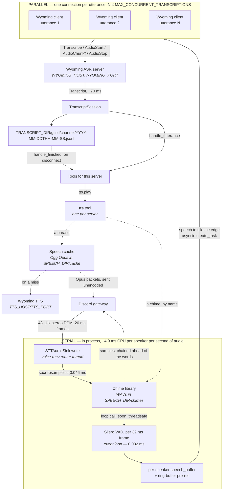

<p align="center">
  
</p>

# miss-quote


> Transcribes Discord voice channels to a per-session, per-speaker JSONL transcript, and hands the result to tools.

Transcription is delegated to a [Wyoming](https://github.com/rhasspy/wyoming) ASR server rather than run in-process, so the bot is a CPU-only workload with no GPU, no model weights, and no cache volume. It is a hard fork of [Leehyunbin0131/Discord-Realtime-STT-Bot](https://github.com/Leehyunbin0131/Discord-Realtime-STT-Bot), which ran `faster-whisper` on a local GPU.

---

## How it works



The dotted half is optional and only exists for servers that enabled the `tts` tool; a deployment where none did never opens a TTS connection. Everything played into a channel goes through that one tool — it owns the cache, the chime library, the volume, and the voice connection, and the tools that decide *what* to say reach it through the toolbox.

Everything runs on one event loop in one process. The split that matters is between the two halves of the pipeline: **audio handling is local and serial, transcription is remote and parallel.**

### Local: serial, continuous, cheap

Resampling and VAD are ordinary blocking calls, run one frame at a time. They are a steady cost for as long as audio arrives, not a per-utterance burst — VAD has to see every frame, because VAD is what decides which frames are speech.

| Work | Cost | Rate, per speaker |
|---|---:|---|
| soxr resample, per 20 ms Discord frame | 0.046 ms | 50/s |
| Silero VAD, per 32 ms frame | 0.082 ms | 31.25/s |

That is **~4.9 ms of CPU per speaker per second of audio**, or about 0.5% of one core — 5% at ten concurrent speakers. Being serial costs nothing at this magnitude, which is why there is no worker process: a process boundary would cost more in serialization than the work it isolated.

Resampling runs on voice-recv's router thread, which holds a lock across all speakers, so nothing slow may be added there. Frames reach the event loop via `loop.call_soon_threadsafe`.

### Remote: parallel, bounded

At each speech-to-silence edge the buffered utterance is handed to `asyncio.create_task` and the coroutine immediately parks on socket I/O — the loop is free in the same tick. Nothing in this process ever blocks on transcription.

The ASR server accepts overlapping utterances, so speakers do not queue behind one another; measured against a GPU-backed Wyoming server, eight simultaneous 0.88 s utterances completed in 223 ms against 555 ms if run serially. A single utterance round-trips in about 70 ms.

`MAX_CONCURRENT_TRANSCRIPTIONS` caps how many are in flight. A further utterance ending while the cap is reached parks on the semaphore — it does not stall the loop and does not drop audio, it simply waits to open its connection. The bound exists so a busy channel cannot fan out unbounded connections against an ASR that other services may share; throughput gains past four are marginal anyway.

Upstream got this backwards: it called `transcribe()` inline in the per-frame loop, so the expensive remote half ran serially while audio backed up in a queue until frames were silently dropped.

---

## Transcript format

Transcripts are filed one directory per guild, one per voice channel inside it, and **one file per session** — one visit by the bot to one voice channel:

```
TRANSCRIPT_DIR/
└── first-server/
    ├── general-voice/
    │   ├── 2026-07-26T20-14-03.jsonl
    │   └── 2026-07-27T09-31-55.jsonl
    └── side-room/
        └── 2026-07-27T21-02-40.jsonl
```

A session opens when the bot joins and closes when it leaves — because the channel emptied, because someone disconnected it, or because the pod terminated. The file is named for the moment it opened and keeps that name until it closes, so **a conversation spanning midnight stays in one file** and **rejoining starts a new one**. A session that opens in the same second as another in the same channel gets a `-2` on the end rather than appending to it.

Rejoining is qualified by the **resume window** (`settings.transcripts.resume_seconds`, 5 s). A channel that empties and refills inside it is treated as one conversation with a gap in it — someone's client dropped, or the last person stepped away — so the transcript is held open and appended to rather than sealed and replaced.

The server directory is its **alias from `servers`**, fixed in configuration rather than read from Discord, so it cannot change underneath the tree. Channels use their Discord name.

Neither carries an ID, which has two consequences worth knowing. **Renaming a channel starts a new directory** with nothing tying it to the old one; that is accepted rather than worked around, since the alternative is an ID in every path to serve a rare event. And **two names that reduce to the same slug share a directory** — two servers given one alias, or two voice channels named `General` and `general`. Their sessions stay in separate files, but nothing in the tree says which file came from where. Nothing about the path can catch either, so the bot logs an error instead: duplicate aliases at startup, colliding channels when it joins one.

Names are lowercased and reduced to `a-z0-9_-`, which drops dots and separators rather than escaping them, so no name can express a path traversal wherever it appears in the string.

JSON Lines, one object per utterance, appended and flushed as produced:

```json
{"ts":"2026-07-26T21:14:03.412-07:00","user_id":1234567890,"user":"someone","text":"that should work"}
```

Guild and channel are not repeated in the line because the path already carries them. `user_id` is recorded alongside the display name because display names change and the path does not encode the speaker.

Timestamps carry an explicit UTC offset, resolved through `TZ`.

### The capture schedule

**When a session may start being written down is `settings.transcripts.schedule`**, a list of a day and a 24-hour range:

```yaml
settings:
  transcripts:
    schedule:
      - Wed 17:00-00:00
      - Sat 12:00-14:00
```

Saying nothing writes everything down, which is what a deployment that has never set this already has.

**A window is when an evening may *start* being recorded, not how long it may run for.** The schedule is read once per session, at the moment the bot joins, and the answer holds until the session seals: **a session that opens inside a window keeps writing until everybody disconnects**, however far past the end of the window that is. An evening does not stop being the evening at midnight, and a transcript cut off mid-conversation is worse than either the whole of it or none of it.

The same rule runs the other way, which is the part worth knowing before setting one. **A session opened a minute early is off the record for its whole length** — it does not start writing when the window arrives — and so is one opened by a rejoin after a pod restart at two in the morning. Leaving the channel and coming back is what fixes both, since that is what opens a new session.

**Only the writing down is scheduled.** Off the record the bot still joins, still transcribes, and still hands each line to the tools that read one utterance at a time — a fine is announced and counted whether or not the evening is being kept, because [`verbal-morality`](#verbal-morality) is given the utterance rather than the file. What the schedule decides is whether anything is left afterwards for a summary to be written from, or for somebody to go back and read. A session that wrote nothing down seals as an empty one and takes its own file away, so an off-the-record evening leaves no trace in the tree and produces no summary. It is logged when it opens, so that is a fact about the deployment rather than something to work out from an empty directory.

**An end at or before the start runs into the following day**, which is how one line says "Wednesday evening": `Wed 17:00-00:00` opens sessions from Wednesday 17:00 until midnight, and `Wed 21:00-02:00` until two in the morning on Thursday. `24:00` may be written for the end of a day, and an end equal to the start is the whole 24 hours. The start is included and the end is not, so `Wed 17:00-00:00` and `Thu 00:00-02:00` meet without overlapping and without leaving a minute between them. Days are `Mon` through `Sun`, or written out, in any case. The clock is `TZ`, the one the transcripts are stamped with and the one somebody writing `Wed 17:00` was reading.

**A schedule nothing could be read out of writes nothing down**, rather than falling back to writing everything down. An entry that cannot be read is dropped and reported at startup, and if none of them survive, the bot says so as an error and captures nothing. A schedule is written by somebody narrowing what is recorded, and a typo in it must not widen it back out: an evening not written down can be had again, and one that should not have been written down cannot be taken back.

---

## Summaries

A transcript is raw material and nobody wants to read one. [`summary`](#summary) turns a sealed session into an account of it, and files that account in a tree with the same shape under its own root:

```
SUMMARY_DIR/
└── first-server/
    └── general-voice/
        ├── 2026-07-26T20-14-03.txt
        └── 2026-07-27T09-31-55.txt
```

The same guild and channel directories, from the same code that names the transcripts', and **a file named for the transcript it summarizes** rather than for the moment it was written. So the two are found from each other by changing one path segment and one extension, a session that took a `-2` to avoid a collision keeps it here, and a summary written late — by a backfill, or by a deployment pointed at a working endpoint after the fact — still lands on the right name.

A separate root rather than a directory inside the transcripts, because the two are different things to hand somebody: a transcript is everything anybody said, and a summary is something you would show people. They can be mounted, backed up, and shared on different terms, and `settings.summaries.retention_days` is its own clock — keeping summaries for a year and transcripts for a month is a reasonable thing to want.

Plain text, not JSON. What is in the file is what the model wrote and what was posted to the channel, so the archive is readable with `cat` and greppable without a parser.

---

## Configuration

Everything about how the bot behaves, and which servers it behaves that way in, is `config.yaml`, mounted at `/config/config.yaml` from a ConfigMap. Point `CONFIG_FILE` elsewhere to override the location. The file is read once at startup, so editing it means restarting the pod. The IDs in the repo copy are placeholders.

```yaml
settings:
  quotes:
    backoff_seconds: 300
  fines:
    volume_floor: 0.25

servers:
  123456789012345678:
    alias: first-server
    users:
      234567890123456789: Speaker One
    tools:
      scoreboard:
        enabled: true
      tts:
        enabled: true
      verbal-morality:
        enabled: true
        config:
          words: [fiddlesticks, poppycock]

  876543210987654321:
    alias: second-server
    users:
      234567890123456789: Someone Else
```

The split against the environment is what a deployment **points at** versus how it **behaves**. Hosts, ports, directories, and the token stay variables: they are what a manifest already carries and what a secret has to stay in. Everything that is a number or a wording — how long a trigger stays spent, what a balance is called, how quiet a repeat offender gets — is `settings:`, because twenty of those spread across a pod spec is a worse thing to read than one file with comments in it. **Settings** below is the list.

`settings:` is optional in its entirety, and so is every line in it: each setting has a default, and a file that mentions none of them is a working file. What it is **not** is a free-form block. A name nothing reads — a typo, or a setting written under the wrong section — is reported at startup rather than ignored, on the same reasoning as a stray key in a tool block: the alternative is a deployment running on a default against a file that plainly asks for something else. A value that will not parse falls back to its default and is reported too, rather than stopping the pod, because this is also the file that decides which servers get joined.

Everything about a server lives under its ID, and the ID appears there and nowhere else. The `alias` names the transcript directory, so renaming a server on Discord changes nothing about where its transcripts land.

`servers` is also a hard gate on joining. A server that is not listed is never joined, by autojoin or by an explicit `!join`, and an empty mapping or a missing file means the bot joins nothing at all. That direction is deliberate: joining no server is something you notice and fix, while recording a server the bot should not have been in is not something you can take back.

Parsing **reports rather than raises**. A server whose block is malformed — no `alias`, or not a mapping at all — is dropped and logged at startup; the bot joins one fewer server instead of crash-looping over a typo. The same goes for a name filed under something that is not a user ID, and a tool whose settings will not parse.

On startup the bot reconciles the file against the servers it is actually in, and says so. Four things can be wrong and none of them raise: an entry would not parse, nothing is configured, a server is configured but the bot was never invited, or the bot is in a server nobody configured. Each is logged, so none has to be discovered by noticing an empty transcript directory.

`users` replaces the display name Discord reports for a speaker. Discord nicknames are freely editable and often not a name at all, which makes them poor labels in a transcript that a summarizer will later read. The roster is per server because the same person can be known differently in two places. IDs may be quoted or bare; both are read as integers.

`tools` elects the server into the tools listed under it — see below. Each is opted into on its own, including the ones others depend on: `verbal-morality` hands its fines to `scoreboard` and its words to `tts`, and a server that enables the first and neither of the others is fining people silently and keeping no record of it. Each absence is reported at startup rather than left to be noticed.

**A tool block holds `enabled` and `config`, and nothing else.** Every setting a tool takes goes under `config:`; written a level up, beside `enabled`, it is read by nothing. That is the one misconfiguration with no symptom — the tool starts, the log says it is enabled, and it runs on its defaults against a file that plainly asks for something else — so anything else in a tool block is named at startup alongside the other parsing problems:

```yaml
      quotes:
        enabled: true
        penalize_self_answers: false   # ← wrong: reported at startup, read by nothing
        config:
          penalize_self_answers: false # ← right
```

---

## Tools

A tool reads a server's transcripts and does something with them. Configuration decides only **which servers a tool applies to** and **what settings it is handed**; the tool itself decides when it runs, by defining any of three methods:

```python
class Example(Tool):
    name = "example-tool"

    async def handle_utterance(self, utterance, session) -> None:
        """Called as each line is written."""

    async def handle_finished(self, transcript) -> None:
        """Called once the session is sealed."""

    async def run(self) -> None:
        """Started once the bot has connected, and left going."""
```

A tool is also handed a `topic`, which is somewhere to put one line where the channel can read it, an `announcer`, which is somewhere to post something longer in a text channel it names, its server's `users` roster, which is the only thing knowable about who might speak before anybody does, and a `tools` box holding the other tools that server has enabled. Answering out loud is not on that list: playing audio belongs to the `tts` tool, and every other tool reaches it through the box — see **Speech** below.

A topic and an announcer are different things and not two spellings of one. A topic is a single line that replaces the last one under a voice channel's name — a tally worth glancing at. An announcement is a message that joins the ones before it in a channel somebody scrolls back through — a summary worth reading later. `scoreboard` uses the first and `summary` the second.

None of the three exists on the base class, so their absence is meaningful: the runner inspects each instance once at startup and files it under the moments it handles. A tool that defines none of them is reported as configured-but-inert rather than silently doing nothing.

- **`handle_utterance`** is dispatched after the line is on disk, so a tool that reads the file sees the same thing it was handed. It is not called for an empty transcription.
- **`handle_finished`** is dispatched once the resume window has passed without a reconnect, so a tool sees one whole conversation rather than a fragment per disconnect. On shutdown, open sessions are sealed immediately rather than waiting the window out. It is not called for a session nobody spoke in: that transcript is removed when the session seals, so there is nothing to hand anybody.
- **`run`** is the tool's own, started once after the bot connects and left going for the life of the process. A tool that only runs never sees a transcript, which is fine — it is still that server's tool, built with that server's settings and roster. `scoreboard` is the one that exists, publishing a tally on an interval.

All three are coroutines running on the bot's event loop; anything blocking is the tool's own business to push onto a thread. A tool is constructed **once per server** that elects into it, so it may hold state, but its handlers can be entered concurrently — utterances are transcribed in parallel and dispatched as they land, not in the order they were spoken.

A tool may also define **`async def prewarm(self)`**, which the runner calls once per process in the background just after the bot connects, and **`async def close(self)`**, which it calls on the way down once every `run` has been cancelled. `prewarm` is for work a tool can do before anybody asks anything of it — rendering what it already knows it will have to say is the use that exists — and, being the first moment at which every tool on a server exists, is also where to complain about one that is missing. `close` is for whatever has to outlive the process. Neither is a moment: a tool defining only these handles nothing and is still reported as inert, and nothing is prepared for, or awaited on behalf of, a tool that can never run. Warming is **serial** across tools, unlike dispatch, because nothing is waiting on it. What a tool does with the moment is hand `tts` the list of phrases it can already see coming; rendering them is `tts`'s own `run`, in the background, one at a time across the whole process.

**One tool can call another.** Every tool a server has enabled shares one box. A tool says which of its neighbours it uses, and reaches them by class:

```python
class VerbalMorality(Tool):
    name = "verbal-morality"
    requires = (Scoreboard, Tts)

    def _scoreboard(self) -> Scoreboard | None:
        return self.tools.find(Scoreboard)
```

Look **at the moment you need it, not in `__init__`**. The box is handed over before any of the server's tools exist and fills as each is built, so a tool that resolves a neighbour at construction finds it or does not depending on the order the config file happens to list them in; by the time anybody has spoken they are all there. Lookup is by class rather than by name so that what a tool depends on is an import a reader can follow, and a tool that is missing comes back as `None` rather than as an error — `verbal-morality` without a `scoreboard` announces fines and does not count them, and without a `tts` counts them and says nothing; both are whole working configurations. A tool that can never run is not in the box at all, so a neighbour never settles for one that will never do anything.

What each tool is given is a **view** of the box bound to its own class, serving only what `requires` names. Asking for anything else comes back `None` with a line in the log. That is not ceremony: `requires` is the graph the startup **cycle check** walks, and a declaration nothing enforces is one that drifts away from the call sites it describes, at which point the check is reading a graph the process does not have.

Two tools that require each other are a stack that does not end. The runner walks the declarations for each server before it builds anything, and a circle is reported and **left unbuilt**:

```
Server 'first-server': tools chicken → egg → chicken require each other in a circle; none of them will be built.
```

Reported here it is a line in the startup report; discovered later it is the process. An edge pointing at a tool the server did not enable is not a circle — there is nothing in the box to call, and the lookup returns the same `None` it always would.

Failures are contained. A tool that raises is logged and otherwise invisible: it cannot cost an utterance, delay a disconnect, or stop another tool from running, warming, or closing. A tool whose `run` raises is logged too, since nothing awaits that task and the exception would otherwise never be collected. A tool that will not construct is reported at startup and skipped.

A tool is only reachable from configuration once it is registered in `tools/registry.py`, which keeps the set of names a config file can switch on a closed list rather than whatever happens to be importable. A name nothing answers to is reported at startup and skipped.

### quotes

Answers the channel with the film line it just walked into. It listens for a trigger phrase and, on hearing one, says the associated quote out loud where it was said — and then asks where the line came from.

```yaml
quotes:
  enabled: true
  config:
    answer_seconds: 5
    tie_seconds: 1
    remarks:
      - having watched it more recently than is respectable.
```

| Setting | Required | Purpose |
|---|---|---|
| `answer_seconds` | no, `5` | How long the channel has to name the title once the line has finished playing. `0` stops the tool asking at all |
| `tie_seconds` | no, `1` | How long after the first correct answer a second one is still paid. `0` pays only whoever was first |
| `penalize_self_answers` | no, `true` | Whether whoever set a line off is barred from naming it. `false` lets them answer like anybody else |
| `self_answer_penalty` | no, `5` | What an attempt costs them, in credits. Floored at `0` |
| `remarks` | no | Endings the announcement draws from, **added** to the ones the tool ships with. A lone one may be written unquoted rather than as a list |
| `announcement` | no | What the winner is told. `{user}`, `{credits}`, and `{remark}` |
| `tie_announcement` | no | What anyone paid on a tie is told. The same placeholders |
| `self_answer_announcement` | no | What somebody naming their own line is told. The same placeholders, where `{credits}` is what it cost |

Everything else is per deployment. The pairs come from a CSV at `QUOTES_FILE` — a film, the phrase that sets it off, and the line — so adding a quote is a row rather than a deployment, and a film everybody in one channel has seen is one everybody in the next has too. The image ships the list in `resources/quotes.csv`; mount your own over that path to say something it does not.

```csv
movie,trigger,quote
Firefly,cool,Shiny.
Firefly,behave,I aim to misbehave.
The Princess Bride,impossible,Inconceivable!
Project Hail Mary,question,{user} question is dumb.
```

| Column | Purpose |
|---|---|
| `movie` | Where the line is from. Never spoken; it is what the round asks about, and what makes the log and the file readable |
| `trigger` | The phrase that sets the line off. Matched whole and case-insensitively, however the file writes it |
| `quote` | What gets said. `{user}` is the only placeholder, and names whoever set it off |

**One trigger per row, and a line may be reached by more than one of them.** Two rows sharing an answer is how the file says that two phrases deserve the same reply — `awesome` and `cool` both earn `Shiny.`. There is no alternation syntax inside a trigger: a trigger is matched as written, so a row meaning to catch two phrases has to be two rows.

**A trigger may also appear on more than one row, and one of its answers is drawn at random each time it fires.** That is how a phrase worth answering several ways says so: the file lists the answers and the channel gets one of them. The draw happens when the trigger fires rather than at startup, so a restart is not what decides which line a channel hears for the next week. Case is not what tells two triggers apart — the trigger is folded before it is keyed, so `Cool` and `cool` are two answers to one trigger. Every answer is rendered at startup, since which one comes up is not knowable before somebody speaks. The backoff is unchanged and still keyed on the trigger, so a trigger with four answers still fires once per window, not four times.

Rows are read at startup and the file **reports rather than raises**. A row with no trigger or no line, a line carrying a placeholder nothing fills, or a row with more fields than columns — an unquoted comma in a line — is logged with its line number and dropped. One typo in fifty rows should cost that row. What *does* stop the tool from starting is a file that is missing, unreadable, has no `movie,trigger,quote` header, or holds no usable row at all: listening for nothing is enabled and useless, which is worth a line at startup instead of silence forever.

The unquoted comma is dropped rather than kept because what survives it is the line **cut at the comma** — `Boy` for `Boy, that escalated quickly.` — and a film line delivered with its second half missing is worse out loud than not being said. It is the only mistake in the file that otherwise loads cleanly, since the reader files the rest of the sentence under an overflow column nothing reads.

**A dropped row is a line in a log nobody reads**, which is why the file is also checked before it can be merged. `scripts/validate_quotes.py` applies the loader's rules where a broken row fails a pull request instead, plus the ones the loader has no opinion about:

| Checked | Why |
|---|---|
| Exactly three fields per row | An unquoted comma in a line is the one mistake that loads cleanly and truncates the quote — `Boy, that escalated quickly.` becomes `Boy` |
| Every column populated, and unpadded | The loader strips surrounding whitespace, so the file and what it produces disagree quietly |
| `trigger` ≤ 30 characters, `quote` ≤ 150 | A trigger has to be said in passing and a line has to land before the channel moves on |
| A trigger that could actually fire | No placeholders, no repeated whitespace, at least one letter or digit. Each compiles into the pattern happily and then matches nothing |
| `{user}` is the only placeholder | Anything else drops the row at startup, so the symptom is a line that is never said |
| No trigger answering twice with the same line | A repeated trigger is deliberate; a repeated *answer* is a row pasted and half-edited, and only weights the draw |
| `movie` non-decreasing, LF endings, trailing newline | So the file stays reviewable and two branches adding a row do not collide |

It is standard library only and imports nothing from `miss_quote`, so it runs on a bare checkout:

```bash
python scripts/validate_quotes.py                      # the shipped file
python scripts/validate_quotes.py /path/to/yours.csv   # one you mount over it
```

The `Validate Quotes` workflow runs it on every push and pull request that touches the file, and takes a path as a `workflow_dispatch` input for checking a list that lives outside this repository.

Matching is **whole words, case-insensitive**, so `real` does not fire inside `really`. Several triggers are phrases rather than words, and a phrase matches on a single space between its words, which is what an ASR transcript holds.

**One line per utterance**, however many triggers were in the sentence: two quotes over the top of each other is a denial of service on the channel, and the pause while the second one plays has outlasted the joke either way. The one that answers is the **earliest in the sentence** rather than the first in the file, since that is the one whoever spoke arrived at. Where two triggers start at the same word the longer wins — `case of the mondays` is in the list precisely because it deserves a different answer from `monday`.

**A trigger that has just fired goes quiet for `settings.quotes.backoff_seconds`**, five minutes by default. The joke is the recognition, and a channel that says "cool" four times in a minute does not want "Shiny." four times back. `0` answers every trigger every time, for a deployment that wants that. The window is keyed on the **trigger**, not the speaker and not the line: what wears out is the phrase, so two people arriving at the same word inside five minutes hear one answer, while two rows that share a line cool down separately. A trigger on backoff does not swallow a live one later in the same sentence — the earliest trigger that is still fresh is the one that answers. The window is per server and held in memory only, so two channels arriving at the same line have each made the joke once, and a restart forgives every backoff.

`{user}` is filled with the name the transcript uses — the roster name from `users` where a server has set one, the Discord display name otherwise — so nothing has to be configured twice.

**The whole list is rendered at startup.** Unlike a fine, a quote is knowable in full before anybody speaks: the triggers are a closed set and so are the answers — every answer of every trigger, including the ones a trigger shares with another row — so on the way up the tool hands `tts` every line in the file. A callback that arrives four seconds after the line it answers is not a callback. The exception is a line naming whoever set it off, which is rendered once per name on the roster; somebody the server has not written down waits for the synthesizer the first time, and nobody waits again. Warming happens in the background, one phrase at a time, and anything already cached is left alone.

#### Naming it

**A line that has been said is also a question.** For `answer_seconds` afterwards the channel can say where it came from — `what is Firefly` — and whoever does is paid a credit through [`scoreboard`](#scoreboard), the same board `verbal-morality` takes them off, and told so out loud.

The window opens when the line has **finished playing**, not when the trigger was heard. Transcription and synthesis take as long as they take, and a window that started at the trigger could be over before the channel had heard the question.

**The first correct answer takes the round, and anyone inside `tie_seconds` of it is paid as well.** Two people arriving at the same title half a second apart both knew it, and which of them the transcriber happened to return first is not a fact about who was faster. Anything later has been beaten to it. Nobody is paid twice for the same title however many times they say it, and the speaker who set the line off is as eligible as anybody else.

Answers are matched forgivingly, because an ASR transcript is not punctuated the way a poster is:

| The file says | So the channel may say |
|---|---|
| `Firefly` | `what is Firefly`, `what's Firefly`, `What is Firefly?` |
| `The Matrix` | `what is the matrix`, `what is matrix` — a leading `the`, `a`, or `an` is optional either way |
| `Hitchhiker's Guide to the Galaxy` | `what is hitchhikers guide to the galaxy` — apostrophes are dropped from both sides |
| `Tucker and Dale vs Evil` | `...vs Evil`, `...vs. Evil`, `...versus Evil` |

The answer may sit anywhere in the sentence: somebody who has it has said so whether or not they said anything else in the same breath. A row with an empty `movie` asks nothing, there being no question in it. A title carrying a **numeral** is matched as a numeral — `Apollo 13` answers to `what is apollo 13` and not to `what is apollo thirteen`, which is what an ASR is likelier to return; write the title the way it will be transcribed if that matters.

**Two rounds can be open at once**, since an answer names its own title and cannot be mistaken for an answer to the other. An utterance that answers an open round is an answer and nothing else, whatever trigger it also contains — otherwise a channel naming a title could set off the line that asks about the next one, which is a loop the tool would be driving rather than following.

Rounds are held in memory, per server, and dropped as they run out. A server with no `scoreboard` asks the question and pays nothing, which is said once at startup rather than left to be noticed; `answer_seconds: 0` stops it asking at all.

#### The announcement

The award is said out loud, with **no chime in front of it**. A fine opens with one because it interrupts a conversation that was about something else; an award answers a question the channel is already sitting in, and a flourish ahead of it would be announcing what everybody is waiting for.

```
Correct! Erik, you are awarded 1 credit for quoting along at home.
```

**The ending is drawn fresh each time**, from the list the tool ships with plus whatever `remarks` adds to it. One fixed sentence is a joke told once and then endured, and this plays every time anybody gets one right. The shipped endings are:

- `knowing exactly where that came from, which explains a great deal.`
- `quoting along at home.`
- `a display of recall that has never once been useful.`
- `having excellent taste and nothing better to do.`
- `being the sort of person who knows that.`
- `spending your formative years exactly as you did.`

`remarks` **adds** to those rather than replacing them, so saying one extra thing costs one line instead of writing out the whole list again. None of the shipped endings says "film" — the CSV column is called `movie` because it started that way, but a trigger answers for a series, a game, or a book as often as a picture, and an announcement that guesses wrong guesses wrong out loud. Write your own the same way.

Somebody paid on a **tie** gets the second wording — `Eli, you are also awarded 1 credit, for getting there at the same time.` — because the whole sentence again reads as though the bot had lost track of what it just said.

**Nothing this tool says is dropped for landing while something else is playing**, which is the one place it parts company with `verbal-morality`. A fine interrupts a conversation that was about something else, so a backlog of them is a channel being read things it has moved on from, and `verbal-morality` drops any fine earned mid-announcement. Everything `quotes` says is an answer to something it just said itself: the line, the award, the tie, the rebuke. Announcements wait their turn on the speaker's per-server lock and come out in the order they were earned.

**Every wording is rendered at startup**, alongside the quotes: every template the server can hear, for every name on the roster, against every ending it can take. Which one comes up is decided when somebody answers; that all of them are already queued for rendering is decided on the way up. A template with a placeholder nothing fills stops the tool from starting, rather than being discovered at the moment there is a credit to explain.

#### Naming your own line

**Whoever set a line off cannot name it.** They have the trigger and the title in front of them and had to recall neither, so a round they could win is one anybody can farm by reading the quote file out loud. An attempt is refused out loud and **costs them `self_answer_penalty` credits**, taken through the same board:

```
Nuh uh uh. Erik, you set it off, so you do not get to name it. You are fined 5 credits for being a dick.
```

Refused rather than quietly ignored, because a rule nobody is told about is one everybody keeps testing. The penalty is deliberately larger than the single credit the attempt was worth, so gaming the round is a losing trade however many times it is tried — and it is taken **once per round** however many times they say it.

An attempt **neither wins the round nor spoils it**: it does not claim the round and does not start the tie window, so whoever names it next is the first answer and is paid in full. The bar is per round, not per person — setting one line off does not disqualify you from naming the next one.

`penalize_self_answers: false` drops the rule entirely. The trigger's speaker becomes an answerer like anybody else, the rebuke is never said, and it is not rendered at startup either.

### summary

Writes down what happened in a voice channel once the bot leaves it, and reads it back out loud when somebody asks. It is the only tool that uses the finished-transcript moment; everything else works on the utterance stream while a conversation is still going.

```yaml
summary:
  enabled: true
  config:
    monitored_channels:
      general-voice:
        channel: session-summaries
```

That is a working block. Everything below has a default.

#### Which channels

**Everything is per voice channel, under `monitored_channels`, and that mapping is also the switch.** A channel that is not in it is not summarized, is not posted, and does not answer the question either — one rule rather than two, so a room left off the list is left off entirely.

Per channel rather than per server because a server's rooms are not interchangeable. One is where a game night happens and one is where two people are debugging something, and a bot that summarizes every room it was ever dragged into is writing files nobody asked for and posting them where everybody can read them. Opting a channel in is a line in the config file; that is the whole of the decision.

Keys are matched through the same slug that names the transcript directory, so `General Voice` and `general-voice` are the same channel, and **the key you write is always exactly the directory the summaries land in**.

#### Writing it down

When a session seals — after the resume window, or immediately on shutdown — the JSONL is reduced to the two fields a summarizer wants:

```
Erik: that should work
Eli: it did not
```

`user_id` goes because a model cannot look anybody up by it. The timestamp goes because the lines are already in the order they were spoken and every prompt says so, which makes a stamp on each one a token per line spent restating what the shape of the input already guarantees. Consecutive lines from one speaker are joined, because the segmenter cuts on a pause rather than on a sentence and three attributions in a row reads as an exchange that never happened.

That goes to the endpoint with the channel's `prompt`, and what comes back is written to `SUMMARY_DIR` and posted to the text channel named in `channel:` — by **name**, resolved against the server when it is posted. A name is what the tool has and what the person writing the config file has in front of them; the cost is that a renamed channel silently stops receiving posts, which is why an unresolvable one is reported at startup rather than at the end of the first session worth keeping. Leaving `channel:` out writes summaries to disk and posts nothing, which is a whole working configuration for a server that only wants the spoken recap.

A session under `minimum_utterances` is not summarized: a summary of four lines is longer than the four lines. **A failure anywhere costs the summary and nothing else** — nothing partial is written and nothing partial is posted, and the transcript is untouched, so a session missed because the endpoint was down can be summarized by hand later.

**A whole session is sent in one request, and it is not truncated.** A long evening is tens of thousands of tokens, and an endpoint whose context will not take it refuses the request — which is a failure like any other: logged, no file, no post, transcript intact. That is deliberate rather than unfinished. Silently cutting a transcript would produce a summary that reads as complete and covers the first hour, which is worse than not having one; splitting it into chunks and summarizing the summaries is a different feature with its own failure modes. Point `LLM_MODEL` at something with the context to hold a session, and if one is refused, the log says which file it was.

> **On shutdown.** A session sealed as the pod goes down is summarized inside the shutdown, before the gateway connection closes, so a whole LLM round trip runs inside the termination grace period and can be killed by it. That is accepted — the transcript survives and the summary is the derived artifact — but it is why `settings.llm.timeout_seconds` should stay well under `terminationGracePeriodSeconds`.

#### Reading it back

**"Miss Quote, what happened last session"** and the bot tells you, out loud, having run the stored summary through a second prompt that turns a thing you read into a thing you say.

It answers **for that channel**, with the whole of the evening asked about. A session still in progress has no summary yet — one is written when the transcript seals — so this is the previous conversation even when it is asked for in the middle of one, which is exactly what "last session" means.

Asking takes **both** a name and a trigger, the name first, in one breath. An unaddressed "what happened last session" is somebody talking to the room, and answering it would be a minute of narration nobody asked for. Punctuation is ignored on both sides, and several spellings of the name ship by default, because an ASR guesses phonetically at a name it has never been told and "Miss Quote" comes back as one word about as often as two.

##### One evening is not always one session

A transcript is one **connection** to a voice channel, and the resume window that covers a blip is five seconds. A room that empties while everyone refills a glass, or a pod that restarts mid-deploy, files the rest of the night separately and summarizes it separately — and answering with the newest of those retells the last forty minutes of a four-hour evening.

So what is looked up is the **run** of consecutive sessions with no more than `session_gap_minutes` between one ending and the next beginning. They are read in order, set end to end, and handed to the reteller as one piece of text; the model is told they may arrive that way, via `{retelling_instructions}`, because each was written as a standalone account and three in a row otherwise open three times.

Three details make that hold up:

- **The gap is measured close-to-open, not open-to-open.** A filename is only when a session *started*. Four hours of conversation followed five minutes later by more of it is one evening, and anything comparing the two names alone sees four hours between them and says otherwise. When a session ended survives on disk only as the timestamp of the last line in its JSONL, so this reads transcripts as well as names.
- **Sessions with no summary still count.** One under `minimum_utterances` is exactly what bridges the two halves around a reconnect. Enumerating summaries alone would break the chain at the point something has to hold it together.
- **A session with no summary is not an answer.** It can as easily be the newest session in the channel, or the last one on the day somebody named — a conversation still in progress, or two minutes at the end of a night. Anchoring an evening on it and stopping would report "no notes" with the notes sitting an hour behind it, so anchors are taken in order until one of them turns up an evening with something in it.
- **An unknown ending stops the chain.** A session whose transcript has been pruned out from under its summary — which is what a longer `summaries.retention_days` asks for — is read as having closed when it opened. That is the safe way to be wrong: it degrades to the old one-session behaviour rather than stitching an unrelated conversation onto somebody's evening.

`session_gap_minutes` is **not** `settings.transcripts.resume_seconds` and should not be set to match it. The resume window holds a session open and delays every summary and post behind it; this is read long afterwards, off files already on disk. Widening the resume window also cannot replace it, because shutdown seals every session regardless — a deploy mid-evening always splits the file.

##### Asking for a particular evening

Sessions get skipped, and other things happen in a voice channel in between, so the most recent evening is not always the one being asked about. A trigger is therefore the **start** of a question rather than the whole of one, and what follows it says which evening:

| Said after a trigger | Means |
|---|---|
| nothing, `last time`, `last session`, `last night`, `last one` | The most recent evening |
| `last week`, `a week ago`, `two weeks ago` … `eight weeks ago` | The evening nearest that date, within three days either way |
| `on the twelfth`, `the twenty fifth`, `the 12th` | That day exactly |

The ordinals are spelled out because that is what comes back: a transcriber writes "the twenty fifth" for a spoken date, not "the 25th". Digits are understood too, for the one that does, but a **bare** number is not a date — "recap the three things" is a request about something else.

A named day is read as one of the last two months: earlier this month if it has already been, and the month before if it has not. Today counts as "has not", since a day that has not finished is not an evening anybody has notes from yet. A day the resolved month does not have — the thirty-first of a month with thirty — is nobody's evening and gets the `missing` line rather than sliding to a neighbouring date nobody named.

Counting back weeks gets a few days of latitude because a channel that meets on a night of the week does not meet on a date; a tie between two equally close evenings goes to the later one. Naming a day gets none. A day with two conversations on it resolves to the later, on the same reading that makes "last time" the most recent rather than the first.

This is also why the trigger list is short. `what happened` covers every row of that table, so there is no line per date anybody might name — and because the stems no longer carry a date, a trigger has to be followed by one of those clauses **or by nothing at all**. That is what keeps "Miss Quote, what happened to my beer" from being a question about last Thursday.

The part worth explaining is the silence. Inference takes seconds, so the bot plays a pre-rendered *"Sure! Let me go look at my notes."* — and **starts the inference before it starts saying it**, so the announcement covers the wait rather than being followed by one. Three things make that work:

- **The lookup happens first.** Reading the files is instant, so the bot never announces that it is going to look and then finds nothing. With nothing to find it says the `empty` line — or the `missing` one, if the trouble is the night that was named rather than the channel — and stops.
- **The completion is started before the preamble is played, not after.** Playback returns when the clip has finished, so asking the model on the next line would put the inference *after* the announcement meant to cover it. `tests/test_summary.py` guards this as a deadlock rather than a timing assertion: the fake preamble will not finish until the model has started, so getting the order wrong hangs the test instead of quietly passing.
- **The preamble, the `empty` line and the `missing` one are rendered at startup**, so each begins on a file read rather than a synthesizer round trip.

A second ask while a retelling is still going is dropped rather than queued — what is queued behind a minute of narration is a minute of the same narration — and `backoff_seconds` is how soon after one the channel can be told it again. The window is per **evening**, not per channel: what it exists to stop is the same story twice, and somebody asking about a different night is asking a second question with a different answer.

**The story ends itself.** A retelling runs to a minute and ends wherever the model chose to end it, so a channel that has been listening has no way to tell "finished" from "stopped" — which is a thing to ask the prompt for rather than a thing to bolt on after it. `bard` is told to close on a line that means the tale is over, in the voice it has been telling it in, and that sign-off is what the room hears. A custom retelling prompt gets the same instruction by writing `{retelling_closing}`.

`closing` is the other way to do it: a fixed sentence, played after the story, for a server that would rather hear the same words every time. It is **unset by default**, since a fixed line following one that has just said goodbye is one goodbye too many. Set it and it is rendered at startup like the preamble, so it starts the instant the words run out. Nothing to tell gets no closing either way — there is no story to have finished.

**The retelling itself is never cached.** The speech cache exists so a phrase said again costs a file read; the account of one evening is composed for one moment and nobody will ever ask for those exact words again. Storing it would leave a quarter-megabyte file that only its own age will ever clear. It is synthesized, played, and let go — the preamble, the empty line, and a `closing` if there is one are the ones worth keeping, and those are.

#### Prompts

Prompts are named and selected by name. Three ship, as prose in `src/miss_quote/resources/prompts.yaml` rather than as strings in the source — a prompt is content, and the file also says which one does each job by default:

| Name | For | Output goes to |
|---|---|---|
| `recap` | The default. An account of the evening for the people who were there, in the order it happened, naming names | A Discord message, so Markdown is fine |
| `minutes` | Topics, decisions, and open questions, as headed sections | A Discord message |
| `bard` | The default retelling. A bard telling the room its own evening back, in the third person, cut down to what actually mattered and signed off so the room knows it ended | **A speech synthesizer**, so it forbids Markdown, bullets, and emoji at some length — a synthesizer reads an asterisk out as a word |

`prompts:` adds your own to those, and one written under a shipped name replaces it — which is how a server that likes the structure of `recap` and not its tone changes the tone without inventing a name for it. It sits at the tool level rather than inside a channel because a prompt is a library entry, and restating a paragraph of instructions once per room is how two of them end up saying different things by accident.

A prompt of your own can pull in the text the shipped ones share by naming it in braces. The prefix says which job the fragment is for, because the two are handed different things: `{transcript_instructions}` is the paragraph describing the script format, which any prompt summarizing a session wants and no retelling prompt should carry — a retelling is given the summary `recap` already wrote, not a transcript. `{retelling_instructions}` says that an evening can arrive as several accounts set end to end and is to be told as one story. `{retelling_closing}` is the instruction to end on a line that means the story is over.

`{words}` is filled separately, per channel, from `retelling_words`, and cannot be used as a fragment name. Any other braces are left exactly as written, so an example of the JSON you want back survives. A shipped prompt naming a fragment that does not exist stops the bot at startup; one of your own is left alone, since braces in it are usually deliberate.

**A prompt named by a name nothing answers to stops the tool from starting**, reported alongside every other startup problem. A tool running on instructions nobody asked for produces summaries that look fine and are not what the file requested, which is worse than a tool that refuses.

#### Per-channel settings

| Setting | Default | Purpose |
|---|---|---|
| `channel` | — | Text channel to post in, by name. Unset writes to disk and posts nothing |
| `prompt` | `recap` | Which prompt summarizes a sealed session |
| `retelling_prompt` | `bard` | Which prompt turns a stored summary into something to say out loud |
| `retelling_words` | `200` | Roughly how long the spoken retelling should be — a target the prompt is told to aim at, not a cap it is cut to. About a minute out loud |
| `minimum_utterances` | `5` | Below this a session is not a conversation and is not summarized |
| `backoff_seconds` | `120` | How soon the channel can be told the same evening again. `0`, or below, tells it every time |
| `session_gap_minutes` | `10` | How long the room can sit quiet before the rest of the night is a different evening. Not `resume_seconds`, and not to be set to match it |
| `preamble` | `Sure! Let me go look at my notes.` | What plays while the model is thinking |
| `empty` | `I don't have any notes from this channel yet.` | What plays when nothing has ever been written down in this room |
| `missing` | `I don't have any notes from then.` | What plays when there are notes, just not from the evening that was named |
| `closing` | — | A fixed line played once the story is told, for a server that wants the same words every time. Unset, and the retelling prompt's own sign-off is what says it finished |
| `name` | `miss quote`, `misquote`, `missquote`, `mis quote`, `ms quote`, `mizquote` | What the bot answers to, in the spellings a transcriber returns for a name it has never been told. **Replaces** the default |
| `triggers` | `what happened`, `what did we do`, `recap`, `read me your notes`, `tell me about` | How asking **starts**; which evening is a clause after it. **Replaces** the default |

### scoreboard

Keeps a running balance per person, writes it down, and puts the standings under the name of whatever voice channel the bot is in. It hears nothing and says nothing out loud; what it does is count for the tools that ask it to.

```yaml
scoreboard:
  enabled: true
```

There is nothing to configure per server. What the tally is counted in and how often it is written and published are `settings.credits`, and where it lives is `CREDITS_FILE`, because there is one file behind every server's board and how often it is written is a property of the file rather than of any one server.

**It is enabled separately from whatever is counting.** A server that wants fines announced but not tallied enables `verbal-morality` and not this; the fines are announced and nothing is kept, and the log says so once at startup rather than leaving it to be discovered by wondering why the channel topic is empty. The same goes for `quotes`, which asks the channel to name what a line came from and pays for it here.

**Other tools count through it.** `credit` and `debit` are the whole interface, and they are what a tool calls when it has decided somebody owes something:

```python
board = self.tools.find(Scoreboard)
if board is not None:
    balance = board.debit(user_id, name, offences)
```

The name arrives with the change rather than being looked up, because the caller has just heard from whoever it is and the board prints whatever it was last told. Where the balance is kept, when it is written, and who is eligible for the board are the scoreboard's business and not the caller's.

**The standings go in the voice channel topic**, as `Eli: -9 Erik: -2 Luke: -1 Ryan: 0`, which makes the topic the scoreboard — visible without asking the bot anything. A fine is a **debit**: everybody starts at nothing and goes down, so the number beside a name reads as what swearing has cost them rather than as points collected. Nothing assumes that direction, and `quotes` calls `credit` to pay for a title named in time, so a balance can climb back toward nothing and past it.

The board holds the **four furthest into the red, worst first**. A leaderboard rearranges itself every time somebody passes somebody else, which is the objection to publishing a whole roster in name order; at four places it is short enough to read at a glance, and who is winning is the thing worth reading. Ties break on the name, so two people on the same balance do not swap places between one edit and the next for no reason anybody can see.

**Only `users` are eligible for the board.** Everyone on the roster starts on it at nothing spent, so a channel says who is being watched before anybody has sworn. Somebody the server never wrote down is still heard, still announced, and still counted under whatever Discord reports — they are simply not published, because a display name its owner can set to anything is not something to put in a channel topic through this. Adding them to `users` puts them on the board with whatever balance they had already run up. A board too long for Discord's 1024 characters is cut on an entry boundary rather than mid-number; four ordinary names never reach it, and the guard is there because nothing stops somebody trying. A server with no roster at all publishes nothing rather than an empty line, since setting the status to nothing would wipe whatever a person had put there.

Counts are **per server**. The same person swearing in two servers owes two separate debts, because a server's words are its own business and so is what they cost. Identity is the user ID and the name is only what gets printed, so a rename does not hand somebody else's debt to whoever inherited their nickname.

The tally is kept in `CREDITS_FILE` and **loaded at startup**, so a restart is not an amnesty. It is written back on the same interval it is published on, and again on shutdown — the shutdown pass writes the file but does not touch the topic, because a channel edit waiting out a rate limit would sit on `SIGTERM` until the pod was killed outright. A file that will not parse is reported and ignored rather than raised on: it is a tally of imaginary money, and the pod starting matters more. One unreadable entry costs one person's total, not the file.

There is **one file behind every server's board**, so the mark for whether it has changed belongs to the file rather than to any one board; two servers ticking a moment apart would otherwise rewrite the whole thing twice for one change. A lock keeps the second write from starting while the first is still going.

What it actually sets is the channel's **status**, not its topic. A voice channel has no topic: `PATCH /channels/{id}` with one is refused, and refused with `CHANNEL_TOPIC_INVALID`, *"Field contains at least one word that is not allowed"* — which reads like a profanity filter and is nothing of the kind, since it refuses a topic of `test` identically. The status is the line the client shows beneath a voice channel's name, which is what a topic looks like on a voice channel and what somebody setting one by hand would set. Settings and prose here say topic because that is what it is to everybody looking at it; only the call itself knows the difference. It needs **Set Voice Channel Status** on the channel — not Manage Channels — and without it the tool logs once per change and keeps counting.

The **status is not set on every change.** Both the write and the edit are driven off a revision counter, so a tally that changed four times between two ticks costs one of each. They run on **separate intervals**, because they are limited by different things: writing a few hundred bytes is cheap and happens every `settings.credits.save_seconds`, while a status edit is rate-limited — though not nearly as hard as a channel rename, at a bucket of roughly six a second — so `settings.credits.topic_seconds` is a question of how often a tally is worth reading rather than of what the API will tolerate. Saving still happens first on every tick: an edit that lands in a bucket can hold the task while discord.py sleeps it out, and a pod terminated in the middle of one should still have the tally on disk from the tick before.

A request Discord **refuses** — a `400`, or a missing permission — is not retried, because retrying it every interval would spend the channel's rate limit on an answer that cannot change. A tally that then changes is published anyway, since what was refused was that text and the next text is not that text. Every failure is logged with the string it was trying to set, because a rejection caused by a name in the tally cannot be diagnosed from the fact of it. A tally that reached nowhere at all — the bot is in no voice channel yet — is left unpublished rather than marked done, so it lands in the next channel the bot joins instead of waiting for somebody to swear again.

The half that talks to Discord is `bot/topic.py`; the tool itself imports no discord, on the same terms as the speaker.

### tts

Says things out loud, and is the only thing that plays anything. It hears nothing and decides nothing; what it does is own the rendered-speech cache, the chime library, the volume, and the voice connection, so that everything a channel hears arrives by one route.

```yaml
tts:
  enabled: true
```

There is nothing to configure per server. Which synthesizer, which voice, how long a clip is kept and how much of one is held back before playback are `settings.tts` and `TTS_HOST` / `TTS_PORT` / `TTS_VOICE`, because there is one synthesizer behind every server. All this setting says is whether **this** server is allowed to speak through it.

**It is enabled separately from whatever is talking.** A server that enables `verbal-morality` and not this counts fines and says nothing; one that enables `quotes` and not this runs its rounds, pays them, and answers nobody. Both are said once at startup rather than left to be discovered by wondering why the channel is quiet.

**Other tools speak through it.** `play` is the whole interface:

```python
speech = self.tools.find(Tts)
if speech is not None:
    await speech.play(session.source, wording, scale=0.5, chime="chime")
```

It returns once the clip has finished, so a tool that says two things in a row gets them in that order rather than on top of each other. `scale` is relative to the deployment's own loudness rather than absolute — `1.0` is however loud the channel asked to be interrupted, and a tool with a reason to be quieter has no business knowing what usual is. `chime` names a WAV in `SPEECH_DIR/chimes`, **without its extension**, played ahead of the words; a chime that is missing costs the chime and not the announcement.

**How a clip reaches Discord is decided here, and it is the difference between free and not.** A phrase with nothing in front of it and nothing to be done to it is handed over exactly as it was stored — Opus packets, no decode, no encode, no resample, and no encoder even constructed. A chime, or any volume below the channel's own, means samples: there is nothing to join onto an encoded packet and nothing in one to multiply. So `quotes`, which never uses a chime and never turns itself down, takes the free path every time, and a backed-off fine with a flourish in front of it does not.

**Rendering in advance is its `run`.** A tool that can work out at startup what it will have to say hands over the list — `enqueue` is synchronous and returns immediately — and this renders it in the background while the bot is already in the channel, one phrase at a time across the whole process. A phrase already queued is dropped; a phrase that will not synthesize is a line in the log and then the next phrase, never the end of the run.

### verbal-morality

The Verbal Morality Bot, after *Demolition Man*. It listens for words the server has decided against and, on hearing one, announces the fine out loud in the channel it was said in. The credits are imaginary but they are counted, by somebody else: the fine is handed to the server's [`scoreboard`](#scoreboard), which is what keeps a balance, writes it down, and publishes the standings. **With no `scoreboard` enabled the fine is announced and not counted**, which the log says once at startup.

```yaml
verbal-morality:
  enabled: true
  config:
    words: [fiddlestick, poppycock]
    announcement: "{user}, you are fined {credits} for {violations} of the verbal morality statute."
    repeat_announcement: "{user}, you are also fined {credits} for {violations} of the verbal morality statute."
    chime: chime
```

| Setting | Required | Purpose |
|---|---|---|
| `words` | yes | Stems of what the server objects to. A lone one may be written unquoted rather than as a list |
| `announcement` | no | What gets said. `{user}`, `{credits}`, and `{violations}` are the placeholders |
| `repeat_announcement` | no | Said instead when the same speaker is fined again inside `settings.fines.repeat_seconds`. Same placeholders |
| `chime` | no | A WAV in `SPEECH_DIR/chimes`, played ahead of the announcement, named without its `.wav` |

Both templates default to the lines above, which the tool carries, so a server that wants the defaults can leave them out. A template with a placeholder nothing fills is rejected at startup rather than at the moment someone swears, and the error names which of the two it was.

The name is the one the transcript uses — the roster name from `users` where a server has set one, the Discord display name otherwise — so nothing has to be configured twice.

**`words` are stems.** Each is expanded once at startup into the endings it is said with — a plural, a past tense, a gerund with and without its `g`, someone who does it, something that is like it, and the three that make it a noun again — so `fiddlestick` also catches `fiddlesticks`, `fiddlesticked`, `fiddlesticking`, `fiddlestickin`, `fiddlesticker`, `fiddlestickers`, `fiddlesticky`, `fiddlestickity`, `fiddlestickery`, and `fiddlestickiness`. A list that has to spell out every ending is a list somebody gets around a week after writing it.

Expansion is English spelling rather than a dictionary: a final consonant doubles after a short vowel (`shit` grows a `shitter`, not a `shiter`), a silent `e` drops before a vowel, a sibilant takes `es`, and a `y` after a consonant becomes an `i` — except before an ending that already starts with one, where it goes without being replaced, so it is `shittiness` and not `shittyiness`.

Doubling really turns on where the **stress** falls, and nothing here knows that, so the syllable count stands in for it — right for the single-syllable words this is mostly pointed at, and wrong for a **compound**, which keeps the stress of the word it ends with. `dipshit` is two syllables and still takes `dipshitting`. Nothing structural separates that from `bugger`, which splits the same way and must stay `buggering`, so the words that carry their doubling into a compound are named in `COMPOUND_ENDINGS` in `utils/stems.py`. If a list grows a compound that conjugates wrong, that is the one line to add to. The `-ity`, `-ery`, and `-iness` endings are there because the words they reach are ones people say: `fuckery`, `buggery`, `shittiness`. Nothing checks whether the result is a word anybody says, and it does not need to — a form nobody utters costs a few bytes in an alternation, while a missing one costs the tool the thing it exists to catch. Note that expansion can reach a word that is innocent on its own; a stem whose endings collide with ordinary speech is worth checking before it goes in the list.

Matching is **whole words, case-insensitive**. A substring match fines the innocent, and the canonical example, Scunthorpe, is a place people live.

**The fine scales with the utterance**: one credit per forbidden word in it, so three of them is `3 credits` and one is `1 credit`. The count is filled into `{credits}` already pluralized, as a numeral — every synthesizer worth pointing this at reads `3` as a number, and `1 credits` is wrong in a way a listener hears. What a credit is *called* is `settings.credits.currency`, and the plural is grown from it by the same spelling rules the word list uses, so `penny` announces as `2 pennies` and no deployment can end up fining anybody `2 pennys`. `{violations}` agrees with the count, reading `a violation` for one and `multiple violations` for more, so the sentence is not left saying "fined 3 credits for a violation". It is a phrase rather than a second count: the number is already in the fine, and saying it twice makes the announcement sound like an invoice.

What does not scale is the number of announcements. Three violations in one utterance earn one, because three announcements over the top of each other is a denial of service on the channel. **A violation earned while an announcement is playing is counted and not announced at all** — the speaker plays one clip at a time and returns when it is finished, so the alternative is a queue, and a channel where three people swear over each other would spend the next minute being read fines for things it has moved on from. The tally is charged either way: what somebody owes is not a function of whether they were told about it.

**Being fined twice in a row is worded differently.** A speaker fined again inside `settings.fines.repeat_seconds` gets `repeat_announcement` — "you are *also* fined" — because reading the whole sentence out again sounds like a bot that has lost track of what it just said. It is per speaker: somebody else swearing in the meantime does not make their first fine a repeat. Both wordings are pre-rendered, so the second one does not cost a synthesizer round trip at the moment it is needed.

**A repeat offender is announced more quietly.** Being fined is the joke, and the joke told fifteen times in five minutes is a denial of service on the conversation. Every violation inside a sliding `settings.fines.backoff_seconds` takes `settings.fines.backoff_percent` off the next announcement, down to `settings.fines.volume_floor` — at the defaults, 5% a violation over five minutes, floored at a quarter of `PLAYBACK_VOLUME`, so fifteen of them reach the bottom. `0` for the percent takes nothing off and turns the backoff off; `0` for the floor silences a repeat offender outright. The first swear in a window is announced at full volume: the backoff is for saying it again. Each forbidden word counts, on the same terms as the fine, so four in a sentence is four steps down however few announcements it took to say so. The window is per speaker and per server, held in memory only — a `settings.fines.backoff_seconds` after their last violation somebody is back to full volume, and a restart forgives whatever backoff they had earned. What it does **not** affect is the tally: what somebody owes is not a function of how loudly they were told about it.

**The announcements are rendered at startup.** The roster is known before anybody speaks and so is the shape of the sentence, so on the way up the tool hands `tts` every name in `users` against one, two, and three violations, in both the first-fine and the repeat wording. Synthesis is the slow part of answering; paying for it before anyone is waiting is what lets the fine land while the offence is still what the channel is talking about. It happens in the background, one phrase at a time — the bot is in the channel and listening while it runs, and a synthesizer asked for a hundred phrases at once is one that is not answering whoever is speaking right now.

Three violations because that is what a sentence usually holds; a fourth is remarkable enough to wait for the synthesizer. Anything already cached, from an earlier run or a real fine, is left alone rather than rendered again — including the second wording where a server has set both templates to the same string. What cannot be warmed is anyone **not** on the roster: they are announced under whatever Discord reports, which is not knowable at startup and not a closed set, so they pay for their first fine and nobody pays for it again. Warming also does not count as playing, so a pre-rendered announcement nobody ever earns ages out of the cache on the usual terms and is warmed again at the next startup.

`chime` is resolved **inside** `SPEECH_DIR/chimes` — a bare name, or a path below it; anything that climbs out is refused at startup. The **extension is left off**: `chime` is `chime.wav`, because WAV is the only format there is here and writing it out said nothing. It must be a **16-bit WAV**, at any sample rate and in mono or stereo, both of which are converted on the way in. WAV rather than MP3 because playing audio without ffmpeg is the point of this path, and nothing in the image can decode anything else. The clip is read once, kept for the life of the process, and never evicted to make room for a phrase. A chime that is missing or will not parse is reported and costs the chime, not the announcement.

A server electing in with no `words` is enabled and listening for nothing, which is reported at startup rather than left to be discovered by swearing at it.

## Speech

Tools answer out loud through the [`tts`](#tts) tool, which is where the cache, the chime library, the volume and the voice connection all live. Below it is a `Speaker`, which the bot implements against the voice channel an utterance came from. Nothing in `tools/` imports discord: a speaker is somewhere to play audio, and it happens to be a voice channel.

Synthesis is a second Wyoming server (`TTS_HOST`, `TTS_PORT`) — recognition and synthesis are both Wyoming, but they are two servers and only one of them wants a GPU. The voice is process-wide: a bot that answers in two voices is a bot nobody can tell is one bot.

**Audio streams.** The client yields chunks as the synthesizer produces them, and playback starts on the first one rather than waiting for the last — resampling and encoding both happen as the audio arrives, so a cache miss plays while it is still being rendered. Discord's player is a thread that asks for exactly one 20 ms frame at a time and treats anything short of one as the end of the clip, so `bot/speaker.py` buffers between the two: filled from the event loop, drained a frame at a time, with the tail padded to a whole frame so the last few milliseconds of a word survive. A synthesizer that stalls mid-clip costs the rest of that clip after `settings.tts.stall_seconds`, not a thread and a voice connection.

**A clip waits for a head start** (`settings.tts.lead_ms`, 500 ms by default) before the first byte of it is handed to the player. Streaming is the contract, not a promise: a synthesizer is free to render a phrase whole before sending any of it, which makes the first chunk the slow one and every chunk after it instant. That is invisible for a clip that is only speech, and audible for one that opens with a chime — the flourish plays, and then the channel sits silent until the sentence it introduced arrives. Waiting for this much speech first moves the wait to before the chime, where nobody is listening yet. A phrase that ends inside the head start is not padded out to it, and `0` starts on the first chunk, which is what a synthesizer that streams as it renders wants.

**Loudness is a deployment setting** (`PLAYBACK_VOLUME`, `1.0` by default), because how loud a synthesizer renders a sentence has nothing to do with how loud a channel wants to be interrupted. It scales every sample on its way to the player, so a chime is turned down with the words behind it, and it is applied at playback rather than folded into a rendered clip — changing it does not invalidate a cache full of phrases. Above `1.0` the result is clipped at full scale rather than allowed to wrap, since int16 wraps to the opposite extreme and that is a crack in the middle of a word rather than more of the same.

It is also the one thing that decides how a clip goes out. At `1.0` there is nothing to do to the audio, so cached clips are sent exactly as stored; anything lower means every clip is decoded and re-encoded on its way past. **Lowering `PLAYBACK_VOLUME` therefore has a CPU cost as well as a loudness one** — turn a channel down at the Discord end where you can.

**No ffmpeg.** It is the usual way to play audio through discord.py, but only because it is the usual way to decode a file first. Synthesized speech is already raw PCM, so `soxr` converts it to the 48 kHz stereo Discord wants and the libopus already present for receiving handles the rest.

A phrase composed for one moment is the exception and is **not** cached at all — see `summary`'s retelling. The cache is for phrases that come round again, and a sentence nobody will ever say twice is a large file on a retention clock only its own age will clear.

**Clips are cached as what Discord is sent**, so a phrase is only ever synthesized once — and, at full volume, never processed again either. One layer: Opus packets, one per 20 ms, in an Ogg container under `SPEECH_DIR/cache`. About a tenth the size of the samples they came from, and playable, so you can hear what the bot actually said.

Storing what Discord wants rather than what the synthesizer produced is what makes a cached phrase free to play. `AudioSource.is_opus` tells discord.py the frames are ready to send, so it builds no encoder at all: **no resample, no encode, no decode, nothing per play**. Previously every play of every cached phrase re-encoded the whole clip — about 37 ms of CPU for three seconds of audio, on the player thread, every single time.

The cost is that **the stored bitrate is the delivered bitrate**. Clips are encoded at 32 kbps in Opus's VoIP mode rather than the 128 kbps discord.py defaults to, which is where the tenfold saving comes from. That mode is built for exactly this content — one synthesized voice — and it is not a setting, because changing it would silently mean two bitrates in one directory.

A clip that has to be **changed** on the way out is decoded first, since a gain is a multiplication and there is nothing to multiply in an encoded packet. That is any clip below full volume — every `verbal-morality` fine past the first, and every clip in a deployment that lowered `PLAYBACK_VOLUME` — and it costs about 8 ms of decode per three seconds of audio, on top of the encode that was always there. `quotes` plays at full volume and takes the free path.

That decode does **not** delay the clip and does **not** hold the event loop. It streams, in batches of a tenth of a second handed to a thread: packets are decoded as they arrive rather than collected first, so the first frame lands about half a millisecond behind where it would at full volume — 0.89 ms against 1.34 ms on a three-second clip already on disk, where one Discord frame is 20 ms.

The batch size is doing real work. Decoding each packet where it arrived put the whole clip's decode on the loop as a single **11.7 ms stall**, which is a third of the 32 ms in which every speaker's next VAD frame is due; a hop per packet would cost more in scheduling than the decode; and one hop for the whole clip would put all of it in front of the first frame. At a tenth of a second the worst stall measured is 0.21 ms, against 0.33 ms of baseline jitter with nothing playing at all.

A hit is a file read — 0.85 ms end to end for a three-second clip, against a 20 ms frame. There is deliberately no memory layer in front of it: there was one, holding the same packets, and it was measured at 0.27 ms off the way to playback while not even saving a filesystem round trip (the reaper ages clips by mtime, so every hit calls `os.utime` whether or not it read the file). An eviction policy and a tuning knob for a quarter of a millisecond is a bad trade.

**`SPEECH_DIR/cache` is therefore load-bearing, not an optimisation.** Mount a writable volume at `SPEECH_DIR`. Without one, every phrase is synthesized again every time it is said and `prewarm` does nothing at all — which is a round trip to the TTS server per announcement instead of a file read, and is reported as an error at startup rather than a warning. Writes go through a temporary file and a rename, because a process killed mid-write would otherwise cache a truncated clip forever, and a clip is only stored once the synthesizer says it is whole — a failure partway through plays what arrived and stores nothing. A file that is truncated anyway, by a torn volume rather than by this process, is refused on the way in rather than played as a clip that stops early: the container's end-of-stream marker is what says the last page is the last page.

> **Upgrading from `TTS_CACHE_DIR`.** One directory used to hold both rendered speech and the clips an operator put there by hand; it is now `SPEECH_DIR` with a subdirectory for each. Point the volume at `/speech` and the cache rebuilds itself on the usual terms — nothing is lost but the first synthesis of each phrase, and `prewarm` pays most of that before anyone is waiting. **A chime has to be moved by hand** into `SPEECH_DIR/chimes`, because nothing reads the old path any more; one left behind is reported at startup as missing rather than guessed at. The old directory is not read, not migrated, and not deleted — it is yours to remove once you are satisfied.

> **Upgrading to the `tts` tool.** Playing audio used to be something every tool could do; it is now one tool, and **a server that does not enable `tts` says nothing.** Add `tts: {enabled: true}` beside whatever already speaks. Fines are still counted and rounds are still paid without it, and the log says so once at startup, so a server that goes quiet after an upgrade has a line explaining why. **A `chime:` setting also loses its extension** — `chime.wav` becomes `chime` — and one left as it was is called out by name rather than reported as a file that is not there.
>
> Clips written by a version older still are `.wav` and cannot be read at all. Anything left in the new cache directory ages out on the retention clock whatever it is named, so nothing has to be cleaned up by hand.

**A phrase can be rendered before it is needed.** A tool that can work out at startup what it will have to say later warms the cache with it from `prewarm`, and a phrase already stored costs nothing to warm. A warmed clip is deliberately **not** treated as a played one: a phrase already there is left exactly as found rather than touched, so what nobody ever earns ages out like anything else nobody plays. With no usable directory there is nowhere to put the result, and warming does nothing rather than paying a synthesizer for audio nobody will ever be served.

**The cache is reaped at startup** (`settings.tts.cache_retention_days`, 90 by default). The directory otherwise only grows: a display name goes into the key, so everyone who has ever been announced leaves a file behind, and none of them is ever asked for again once they leave the server. Age is the **mtime**, not the filename, and every hit touches the file, so what is still in use stays however old it is and only what nothing plays ages out. A reaped phrase costs one synthesis the next time it is said.

**Everything in the cache directory is reaped**, because everything in it is the cache's — a clip this version wrote, one an earlier version wrote in a format nothing can read now, or a `.partial` orphaned by a process killed mid-write. All three want the same thing. The scan does not descend into subdirectories and does not remove them, so a directory somebody makes in there is a directory they still have. Any value below `1` disables the reaper entirely, so `0` is a no-op rather than "delete everything".

### Chimes

`SPEECH_DIR/chimes` holds **clips nobody synthesized** — a flourish a tool plays ahead of what it has to say. Drop a 16-bit WAV in and name it from the tool's config, without the extension; it is read once, converted to playback PCM, and held for the life of the process.

It is a separate directory from the cache and that is the whole point: nothing writes here and nothing reaps here, so a clip somebody put there deliberately is never on a retention clock meant for a phrase said once. Names are resolved against the directory rather than taken at their word — a bare name or a path below it, and anything that climbs out is refused — so a setting cannot be pointed at an arbitrary file on the host. The directory does not have to exist; an absent one is a missing chime, reported by whichever tool asked for it, rather than a failure to start.

## Settings

The `settings:` block of `config.yaml`, described under **Configuration** above. Every one of these has a default, so none of them has to be written down; a name or a value that will not parse is reported at startup and falls back to the default.

### `tts`

Only used by tools that answer out loud. Where the synthesizer *is* is `TTS_HOST` and `TTS_PORT`, and which voice it uses is `TTS_VOICE`.

| Setting | Default | Purpose |
|---|---|---|
| `timeout_seconds` | `30.0` | Budget for a **single** wait on the synthesizer, not for a whole clip — a long phrase arriving steadily is not cut off for taking a long time |
| `stall_seconds` | `10.0` | How long the player waits mid-clip for audio that never comes before ending it |
| `lead_ms` | `500.0` | How much speech to have in hand before a clip starts playing, so a synthesizer that renders a phrase whole leaves no gap behind a chime. `0` starts on the first chunk |
| `cache_retention_days` | `90` | Days anything in `SPEECH_DIR/cache` survives without being played, counted from the last time it was. Also what clears out clips an earlier version wrote as WAVs, and `.partial` files orphaned by a process killed mid-write. Any value below `1` keeps them forever. Chimes live elsewhere and are never reaped |

### `credits`

Only used by `scoreboard`. Where the tally is written down is `CREDITS_FILE`.

| Setting | Default | Purpose |
|---|---|---|
| `currency` | `credit` | What a balance is denominated in, in the singular. The plural is grown from it by the spelling, so `penny` announces as `2 pennies`. Wording only — it changes nothing about what is counted |
| `save_seconds` | `5.0` | How often a changed tally is written to disk. `0`, or any value below it, stops the loop: the tally is kept in memory and written only on shutdown |
| `topic_seconds` | `10.0` | How often a changed tally is published to the voice channel topic — set as the channel **status**, a voice channel having no topic. `0`, or any value below it, keeps the tally off the channel entirely |

### `fines`

Only used by `verbal-morality`. What a fine is *worth* is the scoreboard's; these are how it is said.

| Setting | Default | Purpose |
|---|---|---|
| `repeat_seconds` | `5.0` | How soon after being fined the same speaker is told they are "also fined" rather than hearing the whole sentence again. `0`, or any value below it, turns the second wording off |
| `backoff_seconds` | `300.0` | The sliding window a violation counts for against how loudly the next one is announced |
| `backoff_percent` | `5` | How much each violation inside that window takes off the next announcement. `0` takes nothing off, turning the backoff off; anything above `100` reaches the floor on the first repeat, and anything negative is treated as `0` rather than made louder |
| `volume_floor` | `0.25` | The quietest a fine is announced, as a fraction of `PLAYBACK_VOLUME`, once a speaker has earned the full backoff. `0` silences a repeat offender entirely; `1` turns the backoff off |

### `quotes`

Only used by `quotes`. The triggers and the lines themselves are a CSV at `QUOTES_FILE`.

| Setting | Default | Purpose |
|---|---|---|
| `backoff_seconds` | `300.0` | How long a trigger stays spent after it fires, so a channel that keeps saying the same word hears the line once. `0`, or any value below it, answers every trigger every time |

### `transcripts`

Where transcripts are written is `TRANSCRIPT_DIR`, and what clock they are stamped with is `TZ`.

| Setting | Default | Purpose |
|---|---|---|
| `retention_days` | `-1` | Days to keep. `-1`, or any value below `1`, keeps forever |
| `resume_seconds` | `5.0` | How long a transcript is held open for a reconnect to the same channel. `0` seals it on disconnect |
| `schedule` | *(unset)* | When a session may start being written down, as a list of `Wed 17:00-00:00`. Unset writes everything down. Read once, when the bot joins: a session opening inside a window runs until the channel empties, and one opening outside it is still transcribed, fined, and answered. See [The capture schedule](#the-capture-schedule) |

### `presence`

What the bot says about itself while a conversation is being kept. Per deployment and necessarily so: Discord has one presence per bot rather than one per server. See [The status](#the-status).

| Setting | Default | Purpose |
|---|---|---|
| `transcribing` | `🎙️ transcribing...` | Shown under the bot's name while any session is on the record, and cleared when none is. Empty turns the signal off. The emoji goes in the words — a custom status has an emoji field of its own, and Discord does not apply it for a bot |

### `llm`

Only used by `summary`. Where the endpoint *is*, what key it wants, and which model to ask for are `LLM_API_BASE`, `LLM_API_KEY`, and `LLM_MODEL`.

| Setting | Default | Purpose |
|---|---|---|
| `timeout_seconds` | `120.0` | Budget for one completion, end to end. Generous next to the ASR's, a summary being several hundred tokens of output rather than a sentence. Keep it well under the deployment's termination grace period — see **summary** above |
| `max_output_tokens` | `1024` | A ceiling on what is **generated**. Not the context window and not the whole request: the input is not counted against it. Named for what it bounds rather than for the wire field it becomes (`max_tokens`), whose name has cost more than one person an afternoon |
| `temperature` | `0.7` | How much licence the model has. Higher than a mechanical transform would want, because the output is prose somebody reads for pleasure |
| `thinking` | `true` | Whether a model that reasons before answering is allowed to. `false` sends `chat_template_kwargs.enable_thinking`, and is sent **only** to turn reasoning off — an endpoint that has never heard of the field is never shown it |

#### On reasoning models

Worth knowing before pointing this at one, because the failure is confusing and the fix is a number.

**Reasoning is generated, so it spends `max_output_tokens`.** A model that thinks before it answers puts the thinking in `reasoning_content` and the answer in `content`, and both come out of the same budget. Run out mid-thought and `content` is empty — a `200` carrying nothing, which reads like a broken endpoint and is a setting. Measured against a 27B reasoning model on a real 1,653-line session: 4,137 generated tokens, of which the answer was about 700. At `1024` it never reached the answer at all.

The client says which of those happened rather than making you find out:

```
the model spent its whole 1024-token budget reasoning and never began the
answer. Raise 'settings.llm.max_output_tokens', or set
'settings.llm.thinking: false' to stop it reasoning at all
```

**Reasoning is also most of the wall clock**, which matters in exactly one place. The same session took 94s with reasoning and 12s without, for summaries of comparable quality. Nobody is waiting on a summary written after everyone has left. Somebody *is* waiting on the retelling — they asked out loud and the preamble covers a few seconds, not ninety — so a deployment pointing at a reasoning model will want `thinking: false`, or a model that does not reason, for the sake of that one path.

**Thinking is stripped whichever way it arrives.** Where a model puts it is a property of the serving stack rather than of the model: beside the answer in a `reasoning_content` field, or inline at the front of `content`, fenced in `<think>` tags. The first costs nothing to ignore — only `content` is ever read. The second is cut out, in every spelling seen in the wild (`<think>`, `<thinking>`, `<reasoning>`, `<thought>`, any casing, with attributes, several blocks), because left in it opens the summary with the model talking to itself and the synthesizer reads the tags out loud. An opening tag with no closing partner is a model cut off mid-thought, so everything after it goes too.

That happens **whether or not `thinking: false` is set**, because the setting is a request and not a guarantee: an endpoint free to ignore it still returns reasoning, and what comes back is still not something to file as a summary.

### `summaries`

Where summaries are written is `SUMMARY_DIR`.

| Setting | Default | Purpose |
|---|---|---|
| `retention_days` | `-1` | Days to keep. `-1`, or any value below `1`, keeps forever. Its own clock, separate from the transcripts': keeping summaries for a year and transcripts for a month is a reasonable thing to want |

---

## Environment

What a deployment points at, rather than how it behaves — that is **Settings** above. `.env` is loaded if present. Nothing about a particular deployment is baked into the image, so the same image runs anywhere the variables below point it at.

| Variable | Default | Purpose |
|---|---|---|
| `CONFIG_FILE` | `/config/config.yaml` | The mounted file holding `settings` and `servers` |

### Discord

| Variable | Default | Purpose |
|---|---|---|
| `DISCORD_TOKEN` | — | Bot token. **Required** — the bot exits immediately without it |
| `COMMAND_PREFIX` | `!` | Prefix for the `!join` / `!leave` commands |
| `AUTOJOIN` | `true` | Join when a human enters a voice channel; leave when it empties. Accepts `true/false`, `1/0`, `yes/no`, `on/off` |

### ASR

| Variable | Default | Purpose |
|---|---|---|
| `WYOMING_HOST` | `localhost` | Hostname or service name of the Wyoming ASR server |
| `WYOMING_PORT` | `10300` | Wyoming's conventional port |
| `STT_LANGUAGE` | `en` | Sent as `Transcribe.language` |
| `MAX_CONCURRENT_TRANSCRIPTIONS` | `4` | Ceiling on in-flight utterances, so a busy channel cannot open unbounded connections against a shared ASR |

### TTS

Only used by tools that answer out loud. A deployment with no such tool enabled never opens a connection.

| Variable | Default | Purpose |
|---|---|---|
| `TTS_HOST` | `localhost` | Hostname or service name of the Wyoming TTS server |
| `TTS_PORT` | `10200` | Wyoming's conventional TTS port |
| `TTS_VOICE` | — | Voice to ask for. Empty takes whatever the synthesizer considers its default, so a server with one voice loaded needs no setting |
| `PLAYBACK_VOLUME` | `1.0` | Scales everything played into a channel, chime included. `1.0` is however loud the synthesizer rendered it, `0.8` is 20% quieter, `1.2` is 20% louder and clipped rather than wrapped. Any value below `0` is treated as silence |
| `SPEECH_DIR` | `/speech` | Audio on disk, as one root with a directory per kind. `cache/` is rendered speech as Ogg Opus, written and reaped by the bot, and the only place it is kept — mount a writable volume here, since without one every phrase is synthesized again every time it is said. `chimes/` is where you put a WAV by hand |

### Quotes

Only used by `quotes`. A deployment with it disabled never opens the file.

| Variable | Default | Purpose |
|---|---|---|
| `QUOTES_FILE` | `/app/src/miss_quote/resources/quotes.csv` | The triggers and the lines they answer with, as a CSV of `movie,trigger,quote`. One list per deployment; the image ships the one in `resources/`, and mounting a file over that path replaces it |

### Credits

Only used by `scoreboard`. A deployment with it enabled nowhere never reads or writes the file, and never touches a channel topic.

| Variable | Default | Purpose |
|---|---|---|
| `CREDITS_FILE` | `/credits/credits.json` | The running tally, as JSON. One file behind every server's board. Mount a volume at its directory to keep what everybody owes across restarts |

### LLM

Only used by `summary`. A deployment with it enabled nowhere never opens a connection.

An OpenAI-compatible chat-completions endpoint and nothing more specific than that: a root, an optional bearer token, and a model name. `/chat/completions` is the whole of the API surface used, which is the part every endpoint claiming compatibility actually implements — so a hosted API, a gateway in front of one, and a model on the next machine over are the same three variables.

| Variable | Default | Purpose |
|---|---|---|
| `LLM_API_BASE` | `http://localhost:8080/v1` | The API root, with `/chat/completions` appended. There is no default that will work out of the box, in the same way there is none for the ASR |
| `LLM_API_KEY` | — | Sent as a bearer token when there is one. Empty sends **no `Authorization` header at all**, rather than an empty credential for an endpoint to decide what to do with. Never logged and never in an error message |
| `LLM_MODEL` | — | What to ask for. **Required** by `summary`; there is no default, a model name being a deployment's own and a guess being a 404 that reads like a broken endpoint |

### Transcripts

| Variable | Default | Purpose |
|---|---|---|
| `TRANSCRIPT_DIR` | `/transcripts` | Directory the session files are written to |
| `SUMMARY_DIR` | `/summaries` | Directory the summaries are written to, in a tree the same shape as the transcripts'. A separate root so the two can be mounted and shared on different terms — see **Summaries** above |
| `TZ` | `America/Los_Angeles` | Timezone for session filenames and the offset stamped on each line |

### Speech segmentation

| Variable | Default | Purpose |
|---|---|---|
| `SPEECH_FLUSH_TIMEOUT_SECONDS` | `2.0` | Transcribe a speech buffer that stopped receiving audio, e.g. a speaker who muted mid-sentence |
| `USER_TIMEOUT_SECONDS` | `60` | Discard per-user VAD state after this much silence |
| `LOG_LEVEL` | `INFO` | Standard Python log levels |

VAD thresholds, the pre-roll depth, and the Wyoming chunk size are deliberately **not** configurable at all, from either place — they are tied to Silero's fixed 512-sample frame and live in `config.py`.

### Retention

Pruning is **off by default**. Any value below `1` disables it entirely, so `0` is a no-op rather than "delete everything" and a mis-set setting cannot destroy the archive. When set to a positive `N`, files older than `N` days are deleted, aged by the **date at the front of the filename** rather than mtime — the filename is the authoritative record of when a transcript was taken, while mtime misjudges a file appended to late or restored from backup. Pruning runs at startup and whenever a session opens.

### Auto-join

With `AUTOJOIN` enabled the bot connects as soon as a non-bot member enters a voice channel, and disconnects once the channel empties of humans. A bot can occupy only one voice channel per guild, so if a second channel becomes active it stays where it is rather than hopping, which would fragment both transcripts.

The `!join` and `!leave` commands remain available either way. They require **Message Content Intent** to be enabled in the Discord Developer Portal.

### Starting and stopping by hand

Two commands override [the capture schedule](#the-capture-schedule) for the session the bot is currently in, for an evening it did not cover or one it did that nobody wanted kept:

| Command | Effect |
|---|---|
| `!start-transcribing` | Puts the open session on the record **from here on**. Nothing said before it was buffered anywhere, so there is nothing to backfill — this starts a transcript rather than completing one |
| `!stop-transcribing` | Takes the open session off the record. **What is already written stays written**; stopping is a decision about what happens next, not a retraction. A session that never wrote anything still takes its own file away when it seals |

**Both require Administrator on the server**, since what they decide is whether everybody in the room is on the record. A refusal is said out loud rather than silently ignored — a rule nobody is told about is one everybody keeps testing.

**The override dies with the session.** Rejoining opens a new one, which consults the schedule afresh. It does survive a resume-window reconnect, since that is the same session.

### The status

While any session is on the record the bot sets its own status to `settings.presence.transcribing` — `🎙️ transcribing...` by default — and clears it when none is.

This is a **transparency signal, not a status readout**. Everybody can see the bot sitting in a channel, and hearing on its own retains nothing material: a fine is counted and the words behind it are gone. What is worth announcing is the part that leaves something afterwards — a transcript on disk, and the summaries and retellings written off it. So there is a wording for being on the record and deliberately none for listening.

It **follows sessions, not speech.** A session being written down shows the status whether or not anybody is talking; driving it off utterances would flicker and spend the gateway's presence budget saying nothing new. Updates are deduplicated and only sent on a transition. A session held open for a reconnect still counts, since it will be appended to if one comes.

Two things are worth knowing before relying on it:

- **The presence is one per bot, not one per server.** Discord has no per-guild presence for bots, so a bot in two servers that is recording in one says so in both. Accepted rather than worked around — the alternative is one bot application per server — and it errs toward saying a conversation may be kept when it is not, which is the safe direction for this particular signal.
- **The emoji is part of the text.** A custom status carries an emoji field of its own, and Discord does not apply it for bots, so the only spelling that reaches anybody is one written inside the words.

Setting the wording to empty turns the signal off.

---

## Changes from upstream

Upstream ran `faster-whisper` in-process on a GPU. Moving transcription to a network call removed the reason for most of the machinery around it.

| Area | Upstream | Here |
|---|---|---|
| Transcription | `faster-whisper` in-process, GPU | Wyoming client, one connection per utterance |
| Concurrency | Child process + three IPC queues, to keep blocking inference off the event loop | One process, one event loop; each utterance is a bounded `asyncio` task |
| Dispatch | Transcription called inline in the per-frame loop, serializing every speaker behind one utterance until the audio queue overflowed and dropped frames | Per-utterance tasks bounded by a semaphore, so speakers overlap |
| Resampling | `torchaudio` | `soxr` |
| VAD | Silero via `torch.hub` | Silero via `onnxruntime`, model vendored in-repo |
| Output | Logged and printed; never persisted | Per-session JSONL file, flushed per utterance |
| Deployment | systemd unit | Container image |

Removed outright: the multiprocessing layer and its queues, the STT health-check thread and its supervisor, `torch` / `torchaudio` / `faster-whisper`, the model and fallback-model settings (`STT_MODEL_ID`, `STT_DEVICE`, `STT_COMPUTE_TYPE`, `STT_BEAM_SIZE`, every `STT_FALLBACK_*`), all `*_QUEUE_MAXSIZE` tuning, `RESULT_POLL_INTERVAL`, `STT_HEALTH_CHECK_INTERVAL`, `SHUTDOWN_TIMEOUT_SECONDS`, and the systemd deployment.

Kept intact because they are the non-obvious part: `stt/user_state.py`'s per-user VAD state machine with stale-speech flushing, and `audio/ring_buffer.py`'s pre-roll buffer, which is what stops the first syllable being clipped.

Added: `AUTOJOIN`, `TRANSCRIPT_DIR`, `TZ`, `WYOMING_HOST`, `WYOMING_PORT`, `MAX_CONCURRENT_TRANSCRIPTIONS`, `PLAYBACK_VOLUME`, `CREDITS_FILE`, `QUOTES_FILE`, `TTS_HOST`, `TTS_PORT`, `TTS_VOICE`, and `SPEECH_DIR`, along with the whole of `config.yaml` — the servers the bot may join, the tools each of them elects into, and the `settings:` block everything above is tuned from.

> **Note on the vendored VAD model.** Silero v5's ONNX graph scores the current frame *together with* the trailing 64 samples of the previous one. Fed a bare 512-sample frame it does not error — it silently returns near-zero probability on unmistakable speech, and the bot transcribes nothing. `stt/vad.py` carries that context between calls, and `tests/test_vad.py` guards it with real speech; silence-based tests pass either way and will not catch a regression.

---

## Project structure

```
miss-quote/
├── Makefile                   # How the tests are run, and the image is built
├── Dockerfile                 # The published image, and the stage tests run in
├── pyproject.toml             # What builds the package, and nothing else
├── setup.cfg                  # The package itself: metadata and where it lives
├── pytest.ini
├── requirements.txt           # What the image installs
├── requirements-test.txt      # What the test stage adds on top of it
├── requirements-dev.txt       # Both of the above, for a working copy
├── config.yaml                # A sample of the mounted file
├── scripts/
│   └── validate_quotes.py     # Checks a quote file in CI; stdlib only, imports nothing
├── src/
│   └── miss_quote/
│       ├── __main__.py        # Entry point: python -m miss_quote
│       ├── config.py          # Grouped configuration (dataclasses)
│       ├── bot/
│       │   ├── client.py      # Bot setup, voice lifecycle, auto-join policy
│       │   ├── audio_sink.py  # AudioSink + resampling bridge
│       │   ├── speaker.py     # Playback into a voice channel, fed while it plays
│       │   ├── topic.py       # A line under the name of the channel the bot is in
│       │   └── announcer.py   # A body of text in a text channel named by a tool
│       ├── audio/
│       │   ├── resampler.py   # soxr, both directions
│       │   ├── opus.py        # Encode to what Discord sends, and the Ogg it is kept in
│       │   ├── gain.py        # Playback loudness
│       │   ├── chimes.py      # Clips kept by hand, read out of SPEECH_DIR/chimes
│       │   └── ring_buffer.py # Pre-speech context buffer
│       ├── stt/
│       │   ├── vad.py         # Silero VAD via onnxruntime
│       │   ├── user_state.py  # Per-user VAD state machine
│       │   ├── processor.py   # Segmentation and bounded dispatch
│       │   ├── wyoming_client.py  # Per-utterance Wyoming round-trip
│       │   └── models/
│       │       └── silero_vad.onnx  # Vendored (~2 MB)
│       ├── llm/
│       │   └── client.py      # An OpenAI-compatible chat completion
│       ├── ledger/
│       │   └── credits.py     # What everybody has left, per server
│       ├── resources/
│       │   ├── quotes.csv     # Triggers and the film lines they answer with
│       │   └── prompts.yaml   # What the model is told to do, as prose
│       ├── tools/
│       │   ├── base.py        # What a tool is: its moments, and what it is handed
│       │   ├── registry.py    # Tool names a config file can switch on
│       │   ├── runner.py      # Per-server instances, dispatch, failure isolation
│       │   ├── quotes.py      # Answers a trigger phrase with the line it belongs to
│       │   ├── scoreboard.py  # The tally, to disk and to the channel topic
│       │   ├── summary.py     # An account of a session, written down and read back
│       │   ├── tts.py         # Says things out loud; the only thing that plays anything
│       │   └── verbal_morality.py  # Fines a speaker, out loud, for the wrong thing
│       ├── summary/
│       │   ├── prompts.py     # Loads the prompt file, fills its placeholders
│       │   ├── dialogue.py    # A transcript as the text a model reads
│       │   └── store.py       # Summaries on disk, and finding the last one
│       ├── transcript/
│       │   └── writer.py      # Per-session JSONL appender + retention
│       ├── tts/
│       │   ├── client.py      # Streaming Wyoming synthesis
│       │   └── cache.py       # Render a phrase once, keep it encoded in SPEECH_DIR/cache
│       └── utils/
│           ├── logging.py
│           ├── phrases.py     # Matching a set phrase against what an ASR wrote
│           └── stems.py       # A stem and the endings it is said with
└── tests/
```

Paths in prose below are written relative to `src/miss_quote/`, which is where all of the code is.

The package directory is `miss_quote` where everything else is `miss-quote`, a hyphen not being importable. It sits under `src/` so that a test run imports the package that is on the path rather than whatever happens to be in the working directory — the failure a flat layout hides is a module that only resolves because pytest added the repository root.

Dependencies stay in `requirements.txt` rather than `setup.cfg`, because one of them is pinned to a VCS revision and the image installs it verbatim. Nothing installs the package: `PYTHONPATH` points at `src/`, in the container and in `pytest.ini` both.

The Silero model is vendored rather than installed, because the `silero-vad` package declares `torch` even in ONNX mode.

---

## Development

```bash
make test
```

The suite runs in the container, not on the machine. `make test` builds the `test` stage of the same Dockerfile the published image comes from and runs pytest inside it, which is exactly what CI does — there is no second recipe that can drift from this one, and no host Python to be the wrong version. The stage carries what a test run needs and the published image does not: pytest, the tests themselves, `scripts/`, and the sample `config.yaml` that one of them parses.

It also settles the awkward dependency. Rendered speech is encoded with libopus rather than handed to discord.py as samples, so `tests/test_opus.py` needs the library loadable; discord.py ships a binary for macOS and Windows and falls back to the system one on Linux, which is how a suite that passes on a laptop fails on a bare runner. The image has it either way.

A narrower run goes through the same target:

```bash
make test PYTEST_ARGS="-k config -vv"
make shell                              # a prompt inside the test image
```

`make help` lists the rest. Working on the code with an editor that wants the imports resolved still wants a local environment, and `requirements-dev.txt` is that environment — it is not what the tests run against.

Changing the quote list needs none of it. `make validate-quotes` is standard library only, runs against the host Python rather than the image, and is what CI runs on a quote-file change — the point being an answer in seconds instead of after an image build.

The ASR path is the riskiest integration and is worth exercising on its own, before any Discord wiring. Point `WYOMING_HOST` at any reachable Wyoming server and send the bundled speech fixture through the client:

```bash
PYTHONPATH=src WYOMING_HOST=<asr-host> python -c "
import asyncio, wave
from miss_quote.stt.wyoming_client import transcribe
with wave.open('tests/fixtures/speech_16k_mono.wav', 'rb') as f:
    pcm = f.readframes(f.getnframes())
print(asyncio.run(transcribe(pcm)))
"
```

A correct setup prints `That should work.` in well under a second.

---

## Deployment

GitHub Actions builds the image and pushes it to GHCR for the repository it runs in; no registry configuration is required beyond the workflow's `packages: write` permission. New GHCR packages are private by default, so the package must be made public once, after the first run, unless the cluster is given a pull secret.

Runtime requirements:

- **A reachable Wyoming ASR server** — set `WYOMING_HOST` and `WYOMING_PORT`. There is no default that will work out of the box.
- **A writable volume at `TRANSCRIPT_DIR`.** Use a shared (`ReadWriteMany`) volume if anything else will need to read the transcripts; a single-writer volume locks them to this pod and forces an export step later.
- **A writable volume at `SUMMARY_DIR`**, if `summary` is enabled anywhere. Without one the summaries are lost at every restart, which costs the archive rather than the feature — each one is still posted to its channel when it is written. The same **reachable OpenAI-compatible endpoint** is what `LLM_API_BASE` and `LLM_MODEL` have to point at; there is no default that will work.
- **A writable volume at the directory holding `CREDITS_FILE`**, if `scoreboard` is enabled anywhere. Without one the tally is forgiven at every restart, which costs the accounting rather than the feature. **Set Voice Channel Status** on each voice channel is what lets the tally reach it; without it the bot keeps counting and says so in the log.
- **A single replica.** Two instances would double-join the voice channel and double-write the transcript.
- **No GPU and no node constraints** — transcription is a network call.

**Cutting a git tag is the deploy action.** Pushing to `main` produces `latest` and a sha tag, neither of which is orderable; a release needs a semver tag, which is what a pinned deployment references and what dependency automation can raise a bump against:

```bash
git tag v0.1.0 && git push origin v0.1.0
```
