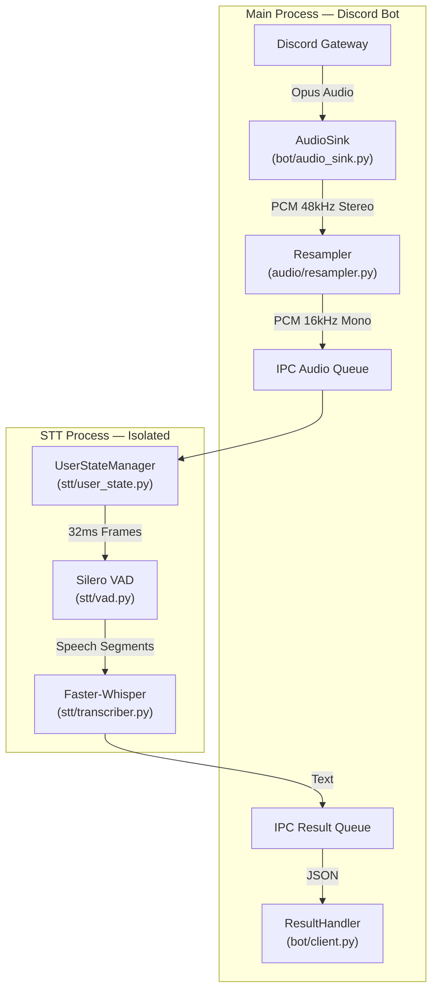

# 🎙️ Discord Real-time STT Bot


> **High-performance, low-latency Speech-to-Text for Discord voice channels.**
> Process-isolated architecture ensures the bot **never** freezes during inference.

---

## ⚡ Key Features

| Feature | Implementation |
|---|---|
| **Multiprocessing Core** | STT runs in an isolated process — bot never freezes |
| **Anti-aliased Resampling** | `torchaudio` Kaiser-window filter (48 kHz → 16 kHz) |
| **Ring Buffer** | 320 ms pre-speech context — first syllable is never cut |
| **Silero VAD** | State-of-the-art voice activity detection |
| **Faster-Whisper** | CTranslate2 — 4× faster than OpenAI Whisper |
| **Structured Logging** | Python `logging` with module-level loggers |
| **Graceful Shutdown** | Signal handlers for clean exit |
| **Per-User State** | Encapsulated `UserState` dataclass per speaker |

---

## 🛠️ Architecture



---

## 📁 Project Structure

```
Discord-Realtime-STT-Bot/
├── main.py                 # Entry point (graceful shutdown)
├── config.py               # Grouped configuration (dataclasses)
├── bot/
│   ├── client.py           # Bot setup, commands, result handler
│   └── audio_sink.py       # AudioSink + resampling bridge
├── audio/
│   ├── resampler.py        # torchaudio anti-aliased resampling
│   └── ring_buffer.py      # Generic ring buffer
├── stt/
│   ├── processor.py        # STT process main loop
│   ├── vad.py              # Silero VAD wrapper
│   ├── transcriber.py      # Faster-Whisper wrapper
│   └── user_state.py       # Per-user state dataclass + manager
├── utils/
│   └── logging.py          # Structured logging config
├── deploy/
│   └── systemd/            # Ubuntu systemd service example
├── requirements.txt
├── .env.example            # Environment template
├── .gitignore
└── README.md
```

---

## 📦 Installation

### Prerequisites (Ubuntu)
-   **Python 3.10+**
-   **FFmpeg** and **Opus** runtime libraries
-   **NVIDIA GPU** is recommended for low latency, but CPU fallback is supported

```bash
sudo apt update
sudo apt install -y python3 python3-venv python3-pip git rsync ffmpeg libopus0 build-essential
```

### 1. Clone & Install
```bash
git clone https://github.com/your-repo/discord-stt-bot.git
cd discord-stt-bot
python3 -m venv .venv
source .venv/bin/activate
python -m pip install --upgrade pip
python -m pip install -r requirements.txt
```
> *Note: `torch` + `faster-whisper` may exceed 2 GB total.*

### 2. Configuration
Create a `.env` file from the checked-in template:

```bash
cp .env.example .env
nano .env
```

At minimum, set:

```env
DISCORD_TOKEN=your_super_secret_token_here
```

For CPU-only Ubuntu servers, start with:

```env
STT_DEVICE=cpu
STT_COMPUTE_TYPE=int8
STT_MODEL_ID=base
```

For CUDA deployments, install the PyTorch build that matches your driver/CUDA runtime before installing the rest of the requirements. See the official PyTorch install selector for the correct index URL.

### 3. Discord Developer Portal
- Enable the **Message Content Intent** for the bot.
- Invite the bot with permissions to read/send messages and connect/speak in voice channels.

### 4. Run
```bash
source .venv/bin/activate
python main.py
```

---

## ⚙️ Configuration (`.env`)

Runtime settings are loaded from environment variables, usually via `.env`.

| Group | Setting | Default | Description |
|:---|:---|:---|:---|
| **Discord** | `DISCORD_TOKEN` | required | Bot token |
| | `COMMAND_PREFIX` | `!` | Prefix command trigger |
| **STT** | `STT_MODEL_ID` | `deepdml/faster-whisper-large-v3-turbo-ct2` | HuggingFace model ID |
| | `STT_DEVICE` | `cuda` | Use `cpu` if no GPU |
| | `STT_COMPUTE_TYPE` | `float16` | Use `int8` for CPU |
| | `STT_LANGUAGE` | `ko` | Transcription language |
| | `STT_BEAM_SIZE` | `1` | Lower = faster, higher = more accurate |
| **Process** | `AUDIO_QUEUE_MAXSIZE` | `512` | Backpressure limit for incoming audio |
| | `SPEECH_FLUSH_TIMEOUT_SECONDS` | `2.0` | Flush final speech if Discord stops sending frames |
| | `USER_TIMEOUT_SECONDS` | `60` | Inactive user cleanup |
| **Audio** | `input_sample_rate` | `48000` | Discord Opus decoded rate |
| | `output_sample_rate` | `16000` | Whisper input rate |

---

## 🧭 Ubuntu systemd Deployment

The repository includes an example unit at `deploy/systemd/discord-stt-bot.service.example`.

Example layout:

```bash
sudo useradd --system --create-home --home-dir /opt/discord-stt-bot discord-stt
sudo rsync -a --exclude .git ./ /opt/discord-stt-bot/
sudo chown -R discord-stt:discord-stt /opt/discord-stt-bot
sudo cp /opt/discord-stt-bot/.env.example /etc/discord-stt-bot.env
sudo nano /etc/discord-stt-bot.env
sudo chmod 600 /etc/discord-stt-bot.env
sudo chown root:root /etc/discord-stt-bot.env
sudo cp /opt/discord-stt-bot/deploy/systemd/discord-stt-bot.service.example /etc/systemd/system/discord-stt-bot.service
sudo systemctl daemon-reload
sudo systemctl enable --now discord-stt-bot
```

Check logs:

```bash
journalctl -u discord-stt-bot -f
```

If using an NVIDIA GPU, make sure the `discord-stt` user can access the GPU devices and that the installed `torch` wheel matches the host driver/CUDA runtime.

---

## 🖥️ Usage

1.  **Summon**: `!join` in any text channel
2.  **Speak**: Talk — the bot listens to everyone simultaneously
3.  **Dismiss**: `!leave` to disconnect
4.  **Stop**: `Ctrl+C` for graceful shutdown

---

## 🧩 Troubleshooting

**Q: The bot joins but doesn't transcribe.**
> Check console logs. Ensure Silero VAD and Whisper model downloaded successfully.

**Q: It's too slow!**
> Set `device = "cuda"` in `config.py`. Running `large-v3` on CPU is not recommended.

**Q: CUDA out of memory?**
> Switch to a smaller model (`base`, `small`) or use `compute_type = "int8"`.

**Q: I see "Audio queue full" warnings.**
> STT inference is slower than the incoming voice stream. Use a smaller model, GPU acceleration, or increase `AUDIO_QUEUE_MAXSIZE` if the host has enough memory.

**Q: The service exits right after startup.**
> Check `DISCORD_TOKEN`, Discord privileged intents, native voice dependencies, and model download/network access in `journalctl -u discord-stt-bot -e`.

---

## 📜 License

MIT License — free to fork, modify, and use.

---

<div align="center">
  <sub>Built with ❤️ for the Open Source Community.</sub>
</div>
